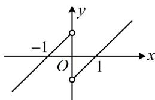

> [!faq]- 《第2节 函数的单调性与奇偶性》例题解析
>
> > [!success]- **【答案】** BCD
>
> > [!note]- **【分析】**
> > 本题未单列分析。
>
> > [!note]- **【解析】**
> > A. $f(x)=\ln(\mathrm{e}^{2x}+1)-x$ B. $f(x)=2^{x}-2^{-x}$ C. $f(x)=\ln\frac{x+1}{x-1}$ D. $f(x)=\left\{\begin{aligned}&x-1,x>0\\ &x+1,x<0\end{aligned}\right.$
> >
> > 解析：A项， $f(-x) = \ln (\mathrm{e}^{-2x} + 1) + x = \ln \left(\frac{1}{\mathrm{e}^{2x}} +1\right) + x = \ln \frac{1 + \mathrm{e}^{2x}}{\mathrm{e}^{2x}} +x = \ln (1 + \mathrm{e}^{2x}) - \ln \mathrm{e}^{2x} + x$
> >
> > $= \ln (1 + \mathrm{e}^{2x}) - 2x + x = \ln (1 + \mathrm{e}^{2x}) - x = f(x)$ ，所以 $f(x)$ 为偶函数，故A项错误；
> >
> > B项， $f(-x) = 2^{-x} - 2^{x} = -(2^{x} - 2^{-x}) = -f(x)$ ，所以 $f(x)$ 为奇函数，故B项正确；
> >
> > C项，由 $\frac{x + 1}{x - 1} >0$ 可得 $(x + 1)(x - 1) > 0$ ，解得： $x < -1$ 或 $x > 1$ ，定义域关于原点对称，
> >
> > 又 $f(-x) = \ln \frac{-x + 1}{-x - 1} = \ln \frac{x - 1}{x + 1} = \ln \left(\frac{x + 1}{x - 1}\right)^{-1} = -\ln \frac{x + 1}{x - 1} = -f(x)$ ，所以 $f(x)$ 为奇函数，故C项正确；
> >
> > D项，分段函数常用定义判断奇偶性， $f(x)$ 的解析式按 $x > 0$ 和 $x < 0$ 分段，我们先看 $x > 0$ 的情况，
> >
> > 当 $x > 0$ 时， $-x < 0$ ，将它们代入解析式得 $f(x) = x - 1$ ， $f(-x) = -x + 1$ ，满足 $f(-x) = -f(x)$
> >
> > 还要再看 $x < 0$ 的情况吗？不用了，有了 $x > 0$ 时， $f(-x) = -f(x)$ ，这意味着当自变量取相反数时，函数值
> >
> > 也总是相反数，所以到此已可得出 $f(x)$ 为奇函数，无需再讨论 $x < 0$ 的情况，
> >
> > 所以 $f(x)$ 为奇函数，故D项正确；另外，也可通过画图来判断此选项，
> >
> > 如图为 $f(x)$ 的大致图象，该图象关于原点对称，故 $f(x)$ 为奇函数.
> >
> >
> > 
