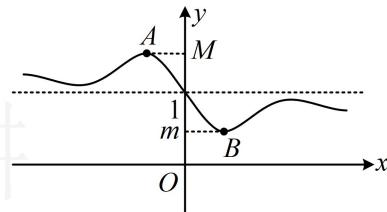

> [!faq]- 《第2节 函数的单调性与奇偶性》例题解析
>
> > [!success]- **【答案】** 2
>
> > [!note]- **【分析】**
> > 本题未单列分析。
>
> > [!note]- **【解析】**
> > 解析：直观想象可发现 $f(x)$ 的最值不好求，所以不去求最值，那怎么办？注意到 $f(x)$ 的分子分母有相同的部分，故先拆项，化为 $f(x) = 1 - \frac{\sin x}{|x| + 1}$ ，而 $y = -\frac{\sin x}{|x| + 1}$ 为奇函数，于是可利用对称性来求 $M + m$ ，
> >
> > 由题意， $f(x) = \frac{|x| - \sin x + 1}{|x| + 1} = 1 - \frac{\sin x}{|x| + 1}$
> >
> > 因为 $y = -\frac{\sin x}{|x| + 1}$ 是奇函数，所以 $f(x)$ 的图象关于点(0,1)对称，
> >
> > 故 $f(x)$ 的图象上的最大值和最小值的两个点 $A$ 和 $B$ 也关于(0,1)对称（如图），由图可知 $M + m = 2$ ：
> >
> > 
>
> > [!tip]- **【反思】**
> > 若 $f(x)$ 为奇函数， $g(x) = f(x) + a$ ，且 $g(x)$ 存在最大值 $M$ 和最小值 $m$ ，则 $M + m = 2a$ 。
