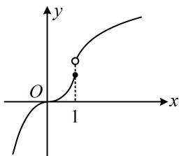

<!-- question-source:start -->
【变式1】已知函数 $f(x) = \begin{cases} x^3, & x \leq 1 \\ \ln (x^2 - 2x + 4), & x > 1 \end{cases}$ ，若 $f(x) > f(2x - 1)$ ，则 $x$ 的取值范围为（）A. $(- \infty, 1)$ B. $(- \infty, -1)$ C. $(-1, 1)$ D. $(-1, +\infty)$

(1) = 1$ ，右侧极限值 $\lim_{x \to 1^{+}} f(x) = \ln 3 > 1$ 所以 $f(x)$ 的大致图象如图，由图可知 $f(x)$ 在 $\mathbf{R}$ 上 $\nearrow$ 所以 $f(x) > f(2x - 1) \Leftrightarrow x > 2x - 1 \Leftrightarrow x < 1$ .

<!-- question-source:end -->

![[高中/总复习/教辅/一数常规版2026/第3章 函数与导数/模块1：函数概念与性质/第2节 函数的单调性与奇偶性/类型04_函数值不等式的解法/例题/answers/Q00049802A1.md]]
