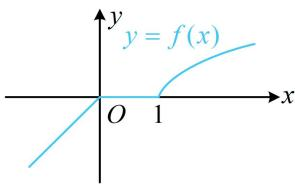

> [!faq]- 《第2节 函数的单调性与奇偶性》例题解析
>
> > [!success]- **【答案】** $\left(-\infty ,\frac{1}{2}\right)$
>
> > [!note]- **【分析】**
> > 本题未单列分析。
>
> > [!note]- **【解析】**
> > 解析：涉及分段函数的函数值不等式，先画图看单调性. 如图， $f(x)$ 在 $\mathbf{R}$ 上不严格 $\nearrow$ ， $f(2a - 1) < f(a)$ 不再等价于 $2a - 1 < a$ ，怎么办？观察图形可发现，只需 $2a - 1 < a$ 且 $2a - 1$ 和 $a$ 不同在中间水平的那段，
> >
> > 因为 $f(2a - 1) < f(a)$ ，所以首先应有 $2a - 1 < a$ ，解得： $a < 1$ ①，另一方面， $2a - 1$ 和 $a$ 不同时在[0,1]上，若由此直接求 $a$ 的范围，则需讨论较多情况，而它的反面只有一种情况，故可先考虑反面，再取补集，
> >
> > 当 $2a - 1$ 和 $a$ 同时在[0,1]上时， $\left\{ \begin{array}{l}0\leq 2a - 1\leq 1\\ 0\leq a\leq 1 \end{array} \right.$ ，解得： $\frac{1}{2}\leq a\leq 1$
> >
> > 所以当 $2a - 1$ 和 $a$ 不同时在 $[0,1]$ 上时， $a < \frac{1}{2}$ 或 $a > 1$ ，结合①可得 $a < \frac{1}{2}$ .
> >
> >
> > 
>
> > [!tip]- **【反思】**
> > 相较于上一题，若分段函数不严格单调，在单调性上再补充自变量不同时位于水平的那段即可.
