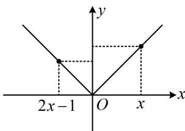

> [!faq]- 《第2节 函数的单调性与奇偶性》例题解析
>
> > [!success]- **【答案】** A
>
> > [!note]- **【分析】**
> > 本题未单列分析。
>
> > [!note]- **【解析】**
> > A. $\left(\frac{1}{3}, 1\right)$ B. $(-1, 1)$ C. $(-\infty, 1)$ D. $(1, +\infty)$
> >
> > 解析：给了偶函数在 $y$ 轴一侧的单调性，可画出草图，并用来分析不等式 $f(x) > f(2x - 1)$ ，
> >
> > 由题意， $f(x)$ 的草图如图，可以看到，图象上离 $y$ 轴越远的点，对应的函数值越大，
> >
> > 观察不等式 $f(x) > f(2x - 1)$ ，其中 $x$ 与 $y$ 轴的距离即为 $\vert x - 0\vert$
> >
> > $$
> > 2 x - 1
> > $$
> >
> > $$
> > \left| 2 x - 1 - 0 \right|
> > $$
> >
> > 所以 $f(x) > f(2x - 1) \Leftrightarrow |x| > |2x - 1|$ ，故 $x^2 > (2x - 1)^2$ ，解得： $\frac{1}{3} < x < 1$ .
> >
> >
> > 
>
> > [!tip]- **【总结】**
> > 当我们看到 $f(\cdots) > f(\cdots)$ 这种结构的函数值不等式时，若发现 $f(x)$ 为偶函
> >
> > 数，则常画出 $f(x)$ 的草图，将函数值的大小关系转化为图象上对应的点离 $y$ 轴距离的大小关系来求解.
