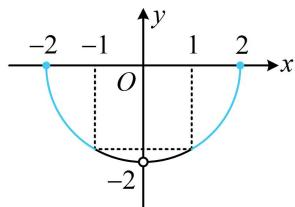

> [!faq]- 《第2节 函数的单调性与奇偶性》例题解析
>
> > [!success]- **【答案】** $\left[\frac{1}{4},\frac{1}{2}\right)\cup (2,4]$
>
> > [!note]- **【分析】**
> > 本题未单列分析。
>
> > [!note]- **【解析】**
> > 解析：$f(x)$ 的解析式较复杂，考虑从研究 $f(x)$ 的性质入手，奇偶性、单调性不易看出，故先求定义域，分子应满足 $4 - x^{2} \geq 0$ ，故 $-2 \leq x \leq 2$ ，此时分母可化为 3 - x - 3 = -x，所以 $x \neq 0$ ，
> >
> > 从而 $f(x)$ 的定义域为 $[-2,0)\cup (0,2]$ ，且 $f(x) = \frac{x\sqrt{4 - x^2}}{-x} = -\sqrt{4 - x^2}$ ，
> >
> > 到此 $f(x)$ 的解析式已被化简, 可通过画图判断单调性、奇偶性, 并用于解所给的不等式,
> >
> > $y = -\sqrt{4 - x^2}\Rightarrow y^2 = 4 - x^2\Rightarrow x^2 +y^2 = 4(y\leq 0)$ ，所以函数 $f(x)$ 的草图如图，
> >
> > 可以看到，图象上离 $y$ 轴越远的点，函数值越大，
> >
> > 故 $f(\log_2 x) > f(-1)$ 等价于 $\log_2 x$ 在蓝色的两段，
> >
> > 所以 $1 < \log_2 x \leq 2$ 或 $-2 \leq \log_2 x < -1$ ，解得： $\frac{1}{4} \leq x < \frac{1}{2}$ 或 $2 < x \leq 4$ 。
> >
> >
> > 
