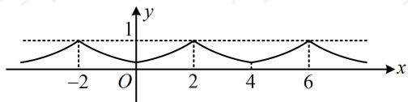

> [!faq]- 《第3节 抽象函数问题》参考答案
>
> > [!success]- **【答案】** BC
>
> > [!note]- **【分析】**
> > 本题未单列分析。
>
> > [!note]- **【解析】**
> > BC
> >
> > 解析：A项， $f(x)$ 是偶函数 $\Rightarrow f(x)$ 关于 $x = 0$ 对称， $f(x + 2) = f(2 - x) \Rightarrow f(x)$ 关于 $x = 2$ 对称，所以 $f(x)$ 是以4为周期的周期函数，故A项错误；  
> > B项，由于是周期函数，画图看最值比较方便，故考虑画图，可结合[0,2]上的解析式和偶函数、周期性来画图，当 $x \in [0,2]$ 时， $f(x) = \left(\frac{1}{2}\right)^{2 - x}$ ，结合 $f(x)$ 是周期为4的偶函数可作出 $f(x)$ 的大致图象如图，所以 $f(x)_{\min} = f(0) = \frac{1}{4}$ ， $f(x)_{\max} = f(2) = 1$ ，故B项正确；  
> > C项，由图可知C项正确；  
> > D项，由图可知 $f(x)$ 在[2,4]上 $\searrow$ ，而 $y = \left(\frac{1}{2}\right)^{2 - x}$ 在[2,4]上 $\nearrow$ ，故D项错误.
> >
> > 
