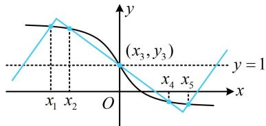

> [!faq]- 《第3节 抽象函数问题》参考答案
>
> > [!success]- **【答案】** B
>
> > [!note]- **【分析】**
> > 本题未单列分析。
>
> > [!note]- **【解析】**
> > B
> > 解析： $g(x)$ 没给解析式，给的是 $g(-x)+g(x)=2$ ，只能得出对称性，所以也要研究 $f(x)$ 的对称性，
> > 注意到 $y=\ln(\sqrt{x^{2}+1}-x)$ 为奇函数，其图象关于原点对称，
> > 所以 $f(x)$ 的图象关于点 (0,1) 对称，
> > 又 $g(-x)+g(x)=2$ ，所以 $g(x)$ 的图象也关于点 (0,1) 对称，
> > 故 $f(x)$ 与 $g(x)$ 的交点关于点 (0,1) 对称，
> > 所以两函数的草图如图，由图可知， $x_{1}+x_{2}+\cdots+x_{5}=0$ $y_{1} + y_{2} + \cdots + y_{5} = 5$ ，所以 $\sum_{i=1}^{5}(x_{i} + y_{i}) = 5$ .
> >
> > 
