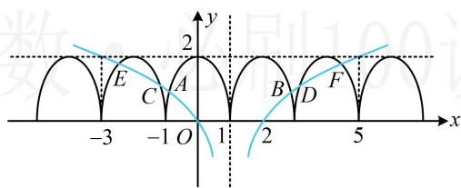

> [!faq]- 《第3节 抽象函数问题》参考答案
>
> > [!success]- **【答案】** B
>
> > [!note]- **【分析】**
> > 本题未单列分析。
>
> > [!note]- **【解析】**
> > B
> >
> > 解析： $f(x) = f(2 - x)\Rightarrow f(x)$ 的图象关于 $x = 1$ 对称， $f(x)$ 为偶函数 $\Rightarrow f(x)$ 的图象关于 $y$ 轴对称，所以 $f(x)$ 的周期为2， $g(x) = 0\Leftrightarrow f(x) = 2\log_4|x - 1|$ ，作出 $y = f(x)$ 和 $y = 2\log_4|x - 1|$ 的图象如图，两图象有6个交点，且它们两两关于直线 $x = 1$ 对称，由图可知， $\frac{x_A + x_B}{2} = 1$ ，所以 $x_{A} + x_{B} = 2$ ，同理， $x_{C} + x_{D} = x_{E} + x_{F} = 2$ 故 $g(x)$ 的零点之和为 $x_{A} + x_{B} + x_{C} + x_{D} + x_{E} + x_{F} = 6$
> >
> > 
