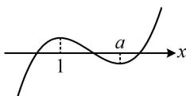

> [!faq]- 《第3节 抽象函数问题》参考答案
>
> > [!success]- **【答案】** AD
>
> > [!note]- **【分析】**
> > 本题未单列分析。
>
> > [!note]- **【解析】**
> > AD
> >
> > 解析：A项，研究三次函数的零点，考虑求导分析单调性，再画草图来看，由题意， $f'(x)=6x^{2}-6ax=6x(x-a)$ ，当a>1时， $f'(x)>0\Leftrightarrow x<0$ 或 x>a， $f'(x)<0\Leftrightarrow0<x<a$ 所以 $f(x)$ 在 $(-∞,0)$ 和 $(a,+∞)$ 上 ↗，在 $(0,a)$ 上 ↘，
> > 又因为 $f(0)=1>0,\quad f(a)=2a^{3}-3a\cdot a^{2}+1=1-a^{3}<0$ 所以 $f(x)$ 的草图如图，由图可知， $f(x)$ 有 3 个零点，
> >
> > 故A项正确；
> >
> > 
> >
> > B 项，当 a<0 时， $f'(x)>0\Leftrightarrow x<a$ 或 x>0，
> >
> > $f^{\prime}(x) < 0 \Leftrightarrow a < x < 0$ ，故 $f(x)$ 在 $(-\infty, a)$ 和 $(0, +\infty)$ 上 $\nearrow$
> >
> > 在 $(a,0)$ 上 $\searrow$ ，所以 $x = 0$ 是 $f(x)$ 的极小值点，
> >
> > 故B项错误；
> >
> > C 项，可以想象，所有三次函数的图象都没有对称轴，故此选项错误，怎样严格论证？正面论证 $f(x)$ 没有对称轴较难，可用反证法，先假设 $x = b$ 是对称轴，再推矛盾，
> > 假设 $f(x)$ 关于 $x = b$ 对称，则 $f(2b - x) = f(x)$ ，
> > 所以 $f(2b - x) - f(x) =$ $2(2b - x)^3 - 3a(2b - x)^2 + 1 - 2x^3 + 3ax^2 - 1$ $= 2[(2b - x)^3 - x^3] - 3a[(2b - x)^2 - x^2]$ $= 2(2b - x - x)[(2b - x)^2 + (2b - x)x + x^2] -$ $3a(2b - x + x)(2b - x - x)$ $= 4(b - x)(4b^2 - 2bx + x^2) - 12ab(b - x)$ $= 4(b - x)(x^2 - 2bx - 3ab + 4b^2) = 0$ 恒成立，这不可能，
> >
> > D 项，三次函数 $y = mx^3 + nx^2 + px + q (m \neq 0)$ 的图象必有对称中心，且对称中心的横坐标是 $-\frac{n}{3m}$ （有极值点时即为极值点的平均数）。若熟悉这一结论，则可直接判断出当 $a = 2$ 时， $(1, f(1))$ 就是 $y = f(x)$ 的对称中心，此选项正确，下面我们给出严格推导，
> > 由题意， $f(1) = 3 - 3a$ ，所以 $y = f(x)$ 关于 $(1, f(1))$ 对称等价于 $f(2 - x) + f(x) = 6 - 6a$ 恒成立， $f(2 - x) + f(x) = 2(2 - x)^3 - 3a(2 - x)^2 + 1 + 2x^3 - 3ax^2 + 1$ $= 2[(2 - x)^3 + x^3] - 3a[(2 - x)^2 + x^2] + 2$ $= 2(2 - x + x)[(2 - x)^2 - (2 - x)x + x^2] - 3a(4 - 4x + x^2 + x^2) + 2$ $= 4(3x^2 - 6x + 4) - 3a(2x^2 - 4x + 4) + 2$ $= (12 - 6a)x^2 + (12a - 24)x + 18 - 12a$ ，令 $(12 - 6a)x^2 + (12a - 24)x + 18 - 12a = 6 - 6a$ ，
> > 则 $\begin{cases} 12 - 6a = 0 \\ 12a - 24 = 0 \\ 18 - 12a = 6 - 6a \end{cases}$ ，解得： $a = 2$ ，
> > 所以当 $a = 2$ 时，曲线 $y = f(x)$ 关于 $(1, f(1))$ 对称，
> > 故 D 项正确.
