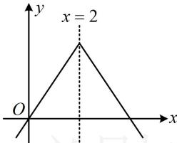

> [!faq]- 《第3节 抽象函数问题》参考答案
>
> > [!success]- **【答案】** B
>
> > [!note]- **【分析】**
> > 本题未单列分析。
>
> > [!note]- **【解析】**
> > B
> >
> > 解析： $f(4 + x) - f(-x) = 0\Rightarrow f(x)$ 关于直线 $x = 2$ 对称，结合 $f(x)$ 在 $[2, + \infty)$ 上为减函数可得当自变量与2的距离越大时，函数值越小，如图，要比较自变量与2的距离，可分析它们与2之差的绝对值， $\left|\log_23 - 2\right| = \left|\log_2\frac{3}{4}\right| = \log_2\frac{4}{3},\quad \left|\log_25 - 2\right| = \log_2\frac{5}{4},\quad \left|3 - 2\right| = 1,$ 因为 $\log_2\frac{5}{4} <  \log_2\frac{4}{3} <  1$ ，所以 $f(3) <   f(\log_23) <   f(\log_25).$
> >
> > 
