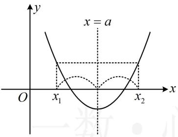
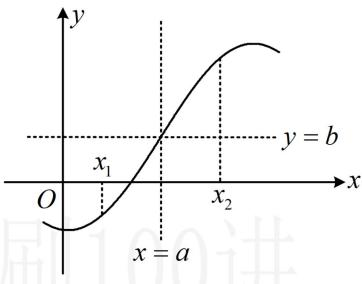

<!-- source-part:1 pages:1-10 -->

# 第3节 抽象函数问题（★★★☆）

## 内容提要

本节涉及抽象函数各类问题，下面的 1\~6（对应类型 I、类型 II 和类型 III）为核心常规内容，第 7 点（对应类型 IV）较难，常出现在压轴小题位置.

1. 轴对称：如果函数 $y = f(x)$ 满足若 $\frac{x_1 + x_2}{2} = a$ ，就有 $f(x_1) = f(x_2)$ ，则 $f(x)$ 的图象关于直线 $x = a$ 对称.

记法：自变量关于 $a$ 对称，函数值相等，如图1.

2. 中心对称：若函数 $y = f(x)$ 满足若 $\frac{x_1 + x_2}{2} = a$ ，就有 $\frac{f(x_1) + f(x_2)}{2} = b$ ，则 $f(x)$ 关于点 $(a, b)$ 对称.

记法：自变量关于 $a$ 对称，函数值关于 $b$ 对称，如图2.

  
图1

  
图2

3. 函数图象的对称轴和对称中心结论（规律： $x$ 系数相反是对称， $x$ 系数相同是周期）

<table><tr><td> $f(x+a)=f(a-x)$ 或  $f(2a+x)=f(-x)$ </td><td> $f(x)$ 关于直线  $x=a$  对称(当  $a=0$  时, $f(x)$  即为偶函数,关于  $y$  轴对称)</td></tr><tr><td> $f(a+x)=f(b-x)$ </td><td> $f(x)$ 关于直线  $x=\frac{a+b}{2}$  对称</td></tr><tr><td> $f(a+x)+f(a-x)=0$ </td><td> $f(x)$ 关于  $(a,0)$  对称(当  $a=0$  时, $f(x)$  即为奇函数,关于原点对称)</td></tr><tr><td> $f(a+x)+f(b-x)=c$ </td><td> $f(x)$ 关于点  $\left(\frac{a+b}{2},\frac{c}{2}\right)$  对称</td></tr></table>

注意：若将上述表格中结论里的 $x$ 全部换成 $2x$ （或 $3x$ 等等），结论不变.

例如，若 $f(2x + a) = f(a - 2x)$ ，则仍可得到 $f(x)$ 关于直线 $x = a$ 对称.

4. 常见的周期结论：由 $f(x + a) = -f(x)$ ， $f(x + a) = \frac{1}{f(x)}$ ， $f(x + a) + f(x) = t$ 均可得出 $f(x)$ 周期为 $2a$ ，其共同的特征是括号内 $x$ 的系数相同，所以像 $f(2x + a) = -f(2x)$ 这种条件，也可得出 $f(x)$ 周期为 $2a$ .

5. 双对称的周期结论（可借助三角函数辅助理解）：

①如果函数 $f(x)$ 有两条对称轴，则 $f(x)$ 一定是周期函数，周期为对称轴距离的2倍.

②如果函数 $f(x)$ 有一条对称轴，一个对称中心，则 $f(x)$ 一定是周期函数，周期为对称中心与对称轴之间距离的4倍.

③如果函数 $f(x)$ 有在同一水平线上的两个对称中心，则 $f(x)$ 一定是周期函数，周期为对称中心之间距离的2倍.

6. 赋值法: 题干给出诸如 $f(xy) = f(x)f(y)$ 这类关系式, 让我们求一些函数值, 或判断奇偶性. 这类题常采用赋值法处理, 具体怎样赋值, 可参考本节例 4.

7. 原函数与导函数的对称结论：设 $f(x)$ 存在导函数 $f'(x)$ ，则二者的对称性有下述结论.

①若 $f(x)$ 有对称轴 x=a，则 $f'(x)$ 有对称中心 $(a,0)$ .

证明： $f(x)$ 有对称轴 $x = a\Rightarrow f(a + x) = f(a - x)$ ，两端求导可得 $f^{\prime}(a + x) = -f^{\prime}(a - x)$

所以 $f'(a+x)+f'(a-x)=0$ ，故 $f'(x)$ 关于点 $(a,0)$ 对称.

②若 $f(x)$ 有对称中心 $(a, b)$ ，则 $f'(x)$ 有对称轴 $x = a$ .

证明： $f(x)$ 有对称中心 $(a,b)\Rightarrow f(a+x)+f(a-x)=2b$ ，两端求导得 $f'(a+x)-f'(a-x)=0$ ，
所以 $f'(a+x)=f'(a-x)$ ，故 $f'(x)$ 关于直线 x=a 对称.

③若 $f'(x)$ 有对称轴 $x = a$ ，则 $f(x)$ 有对称中心 $(a, b)$ .

证明： $f'(x)$ 有对称轴 $x = a \Rightarrow f'(a + x) - f'(a - x) = 0$ ，我们把此式看成由某式求导得出，则该式为 $f(a + x) + f(a - x) = C$ ，令 C = 2b 得 $f(a + x) + f(a - x) = 2b \Rightarrow f(x)$ 关于 $(a, b)$ 对称；特别地，当 a = 0 时， $f'(x)$ 为偶函数，只能得出 $f(x)$ 关于点 $(0, b)$ 对称，不一定是奇函数。

④当 $f'(x)$ 有对称中心 $(a, b)$ 时，若 $b \neq 0$ ，则 $f(x)$ 不一定有对称轴；若 $b = 0$ ，则 $f(x)$ 有对称轴 $x = a$ .

证明： $f'(x)$ 有对称中心 $(a,b)\Rightarrow f'(a+x)+f'(a-x)-2b=0$

我们把上式看成由某式求导得出，则该式应为 $f(a + x) - f(a - x) - 2bx = C$ ， $C$ 为常数，

在上式中令 $x = 0$ 可得 $C = 0$ ，代入上式整理得： $f(a + x) = f(a - x) + 2bx$

当 $b = 0$ 时，上式即为 $f(a + x) = f(a - x) \Rightarrow f(x)$ 有对称轴 $x = a$

而当 $b \neq 0$ 时, 无法得出 $f(x)$ 有对称轴;

特别地，若 $a = b = 0$ ，即 $f^{\prime}(x)$ 为奇函数，我们发现此时 $f(x)$ 关于 $x = 0$ 对称，为偶函数.

![[高中/总复习/教辅/一数常规版2026/第3章 函数与导数/模块1：函数概念与性质/第3节 抽象函数问题/类型01_单对称问题/类型01_单对称问题.md]]
![[高中/总复习/教辅/一数常规版2026/第3章 函数与导数/模块1：函数概念与性质/第3节 抽象函数问题/类型02_双对称推周期问题/类型02_双对称推周期问题.md]]
![[高中/总复习/教辅/一数常规版2026/第3章 函数与导数/模块1：函数概念与性质/第3节 抽象函数问题/类型03_抽象函数赋值法/类型03_抽象函数赋值法.md]]
![[高中/总复习/教辅/一数常规版2026/第3章 函数与导数/模块1：函数概念与性质/第3节 抽象函数问题/类型04__此类型较难__涉及导数的抽象函数问题/类型04__此类型较难__涉及导数的抽象函数问题.md]]
![[高中/总复习/教辅/一数常规版2026/第3章 函数与导数/模块1：函数概念与性质/第3节 抽象函数问题/强化训练/强化训练.md]]
