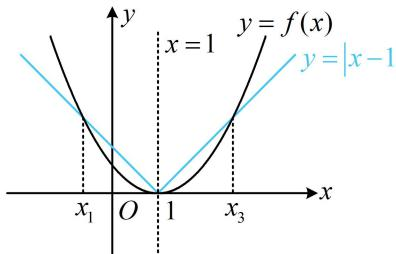

> [!faq]- 《第3节 抽象函数问题》例题解析
>
> > [!success]- **【答案】** 3
>
> > [!note]- **【分析】**
> > 本题未单列分析。
>
> > [!note]- **【解析】**
> > 解析：看到 $f(x) = f(2 - x)$ ，马上想到 $f(x)$ 的图象关于 $x = 1$ 对称，
> >
> > 要研究 $y = |x - 1| - f(x)$ 的零点，可将 $|x - 1|$ 和 $f(x)$ 分离，作图看交点， $|x - 1| - f(x) = 0 \Leftrightarrow |x - 1| = f(x)$ ，
> >
> > 函数 $f(x)$ 没给解析式, 联系前面的对称条件, 考虑从图象对称的角度来分析交点的情况,
> >
> > 由于 $y = f(x)$ 和 $y = |x - 1|$ 的图象都关于直线 $x = 1$ 对称，
> >
> > 故它们的交点关于直线 $x = 1$ 对称，如图，设 $x_{1} < x_{2} < x_{3}$ ，则必有 $\frac{x_1 + x_3}{2} = 1$ 且 $x_{2} = 1$ ，所以 $x_{1} + x_{2} + x_{3} = 3$
> >
> >
> > 
