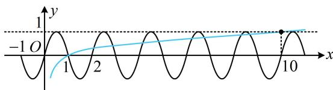

> [!faq]- 《第3节 抽象函数问题》例题解析
>
> > [!success]- **【答案】** 详见解析
>
> > [!note]- **【分析】**
> > 本题未单列分析。
>
> > [!note]- **【解析】**
> > 解析：$y = f(x) - \lg x$ 的零点无法直接求, 可变形后画图看交点,
> >
> > 由题意， $f(x)-\lg x=0\Leftrightarrow f(x)=\lg x,\quad f(2+x)+f(-x)=0\Rightarrow f(x)$ 的图象关于点 $(1,0)$ 对称①，
> >
> > 又 $f(x)$ 为奇函数，所以 $f(x)$ 的图象关于原点对称，结合①可得 $f(x)$ 的周期为2，
> >
> > 到此已可得出 $f(x)$ 的大致图象如图，由于 $f(x)$ 在直线 $y = 1$ 上方没有图象，故作图时应重点关注 $y = \lg x$ 穿
> >
> > 出该直线的位置，
> >
> > 因为 $\lg 10 = 1$ ，所以如图， $y = \lg x$ 与 $y = f(x)$ 的图象共有9个交点，故函数 $y = f(x) - \lg x$ 有9个零点.答案：9
> >
> > 
