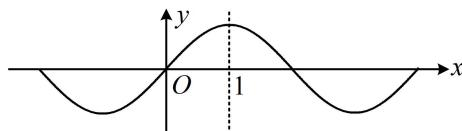

> [!faq]- 《第3节 抽象函数问题》例题解析
>
> > [!success]- **【答案】** BC
>
> > [!note]- **【分析】**
> > 本题未单列分析。
>
> > [!note]- **【解析】**
> > A. $f(2023) = 2$ B. $f^{\prime}(x)$ 的周期是4C. $f^{\prime}(x)$ 是偶函数 D. $f^{\prime}
> > (1) = 1$
> >
> > 解析：奇函数和 $f(x+2)=f(-x)$ 都涉及对称性，故 $f(x)$ 有两种对称性，可先由此找 $f(x)$ 的周期， $f(x)$ 为奇函数 $\Rightarrow f(x)$ 有对称中心(0,0)， $f(x+2)=f(-x)\Rightarrow f(x)$ 有对称轴x=1，由双对称的周期结论可知， $f(x)$ 是周期为4的周期函数，A项， $f(2023)=f(506\times4-1)=f(-1)$ ，又 $f(x)$ 为奇函数，所以 $f(-1)=-f
> > (1)=-2$ ，从而 $f(2023)=-2$ ，故A项错误；B项，可以想象， $f'(x)$ 与 $f(x)$ 应有相同的周期，下面我们也给出证明过程，因为 $f(x)$ 周期为4，所以 $f(x+4)=f(x)$ ，两端求导可得 $f'(x+4)=f'(x)$ ，所以 $f'(x)$ 的周期也为4，故B项正确；C项，奇函数的导函数为偶函数，我们可仿照B项的过程来做个推导，因为 $f(x)$ 为奇函数，所以 $f(-x)=-f(x)$ ①，要论证的是 $f'(x)$ 的奇偶性，故考虑两端求导， $f(-x)$ 这部分要用复合函数求导准则，可将其看成 $y=f(u)$ 与u=-x的复合，所以 $[f(-x)]'=f'(u)\cdot u'=f'(-x)\cdot(-1)=-f'(-x)$ ，将①两端求导得 $-f'(-x)=-f'(x)$ ，所以 $f'(-x)=f'(x)$ ，从而 $f'(x)$ 为偶函数，故C项正确；D项，如图，可以想象， $f(x)$ 的图象关于直线x=1对称，那么 $f(x)$ 必在x=1处取得极值，所以 $f' (1)=0$ ，下面我们也给出这一结论的严格推导过程，由题意， $f(x+2)=f(-x)$ ，两端求导可得 $f'(x+2)=-f'(-x)$ ，取x=-1可得 $f' (1)=-f' (1)$ ，所以 $f' (1)=0$ ，故D项错误。
> >
> > 
