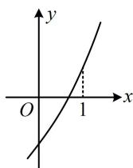

> [!faq]- 《第1节 判断函数零点所在区间》参考答案
>
> > [!success]- **【答案】** B
>
> > [!note]- **【分析】**
> > 本题未单列分析。
>
> > [!note]- **【解析】**
> > B
> > 解析：因为 $y=2^{x}$ 和 $y=3x+a$ 都在 R 上 $\nearrow$ ,
> > 所以 $f(x)=2^{x}+3x+a$ 在 R 上 $\nearrow$ ,
> > 如图， $f(x)$ 在 $(0,1)$ 上存在零点等价于 $\left\{\begin{aligned}f(0)<0\\ f(1)>0\end{aligned}\right.$ 即 $\left\{\begin{aligned}1+a<0\\ 5+a>0\end{aligned}\right.$ ，解得：-5<a<-1。
> >
> > 
