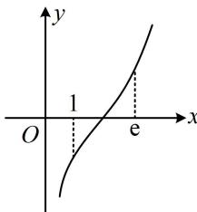

<!-- source-part:1 pages:1-3 -->

# 模块二 函数三类基础题型

# 第1节 判断函数零点所在区间（★☆）

## 内容提要

本节归纳如何判断函数零点在哪个区间这类问题，先梳理零点的概念和零点存在定理.

1. 零点的定义：满足 $f(x) = 0$ 的 $x$ 叫做 $f(x)$ 的零点。（注意：零点不是点，而是数）

2. $x_0$ 是 $f(x)$ 的零点 $\Leftrightarrow f(x_0) = 0 \Leftrightarrow x_0$ 是 $f(x)$ 的图象与 $x$ 轴交点的横坐标.

3. 零点存在定理: 若 $f(x)$ 在 $[a, b]$ 上的图象是一条连续不断的曲线, 且 $f(a)f(b) < 0$ , 则 $f(x)$ 在 $(a, b)$ 上有零点. 需注意, 在零点存在定理中, $f(a)f(b) < 0$ 是 $f(x)$ 有零点的充分条件, 不是必要条件, 即使不满足 $f(a)f(b) < 0$ , $f(x)$ 在 $(a, b)$ 上也可能有零点.

判断零点所在区间，抓住端点值、单调性这两点就可以了。若遇到端点处函数值无意义的选项，可先判断其他选项，若一定要判断此选项，则使用极限分析趋势。

【例题】函数 $f(x) = \left(\frac{1}{3}\right)^x - x - 5$ 的零点所在的一个区间是（）
A. (-3, -2) B. (-2, -1) C. (-1, 0) D. (0, 1)

解析：注意到 $y = \left(\frac{1}{3}\right)^x$ 和 $y = -x - 5$ 都在 $\mathbf{R}$ 上，所以 $f(x)$ 在 $\mathbf{R}$ 上，故 $f(x)$ 最多1个零点，要判断零点所在区间，只需看哪个区间端点函数值异号，下面从选项A开始验证，因为 $f(-3) = \left(\frac{1}{3}\right)^{-3} - (-3) - 5 = 25 > 0$ ， $f(-2) = \left(\frac{1}{3}\right)^{-2} - (-2) - 5 = 6 > 0$ ，所以 $f(x)$ 在 $(-3, -2)$ 上没有零点；又 $f(-1) = \left(\frac{1}{3}\right)^{-1} - (-1) - 5 = -1 < 0$ ，所以 $f(-2)f(-1) < 0$ ，从而 $f(x)$ 在 $(-2, -1)$ 上有零点，故选B. 答案：B

【反思】像这种单选题，无需判断单调性，直接验证端点值是否异号即可，解析为了严谨，故而判断了单调性.

【变式1】函数 $f(x) = \ln x + x$ 的零点所在的区间是（ ）A. $\left(0, \frac{1}{\mathrm{e}^2}\right)$ B. $\left(\frac{1}{\mathrm{e}^2}, \frac{1}{\mathrm{e}}\right)$ C. $\left(\frac{1}{\mathrm{e}}, \frac{1}{2}\right)$ D. $\left(\frac{1}{2}, 1\right)$

解析：因为 $y = \ln x$ 和 $y = x$ 都 $\nearrow$ ，所以 $f(x) = \ln x + x$ 也 $\nearrow$ ，故 $f(x)$ 最多1个零点，

因为当 $x \to 0^{+}$ 时， $f(x) \to -\infty$ ， $f\left(\frac{1}{\mathrm{e}^2}\right) = \ln \frac{1}{\mathrm{e}^2} + \frac{1}{\mathrm{e}^2} = -2 + \frac{1}{\mathrm{e}^2} < 0$ ，所以 $f(x)$ 在 $\left(0, \frac{1}{\mathrm{e}^2}\right)$ 上无零点；又 $f\left(\frac{1}{\mathrm{e}}\right) = \ln \frac{1}{\mathrm{e}} + \frac{1}{\mathrm{e}} = -1 + \frac{1}{\mathrm{e}} < 0$ ，所以 $f(x)$ 在 $\left(\frac{1}{\mathrm{e}^2}, \frac{1}{\mathrm{e}}\right)$ 上无零点；

因为 $f\left(\frac{1}{2}\right) = \ln \frac{1}{2} +\frac{1}{2} = -\ln 2 + \frac{1}{2} = -\ln 2 + \ln \sqrt{\mathrm{e}} = \ln \frac{\sqrt{\mathrm{e}}}{2} < 0$ ，所以 $f(x)$ 在 $\left(\frac{1}{\mathrm{e}},\frac{1}{2}\right)$ 上无零点；因为 $f(1) = 1 > 0$ ，所以 $f\left(\frac{1}{2}\right)f(1) <   0$ ，故 $f(x)$ 的零点所在的区间为 $\left(\frac{1}{2},1\right)$

答案: D

【变式2】若函数 $f(x) = \ln x + x^2 - a$ 在区间 $(1, \mathbf{e})$ 上存在零点，则实数 $a$ 的取值范围为（）A. $(1, \mathbf{e}^2)$ B. $(1, 2)$ C. $(1, \mathbf{e}^2 + 1)$ D. $\left(2, \frac{2}{\mathbf{e}} + 2\right)$

解析：题干只说 $f(x)$ 在 $(1, e)$ 上有零点，没说几个，为了确定零点可能的个数，先分析 $f(x)$ 的单调性，

$$
y = \ln x
$$

$$
y = x ^ {2} - a
$$

$$
(0, + \infty)
$$

$$
\nearrow
$$

$$
\nearrow
$$

如图， $f(x)$ 在 $(1,\mathbf{e})$ 上存在零点等价于 $\left\{ \begin{array}{l}f(1) <   0\\ f(\mathbf{e}) > 0 \end{array} \right.$ ，即 $\left\{ \begin{array}{ll}1 - a <   0\\ 1 + \mathbf{e}^2 -a > 0 \end{array} \right.$ ，故 $1 <   a <   1 + \mathbf{e}^2$

答案: C

【变式3】已知函数 $f(x) = \log_a x + x - b (a > 0 \text{且} a \neq 1)$ ，若当 $2 < a < 3 < b < 4$ 时， $f(x)$ 的零点 $x_0 \in (n, n + 1)$ ， $n \in \mathbf{N}^*$ ，则 $n =$ \_\_\_\_.

解析：问题即为求 $f(x)$ 的零点在哪两个相邻正整数之间，没说 $f(x)$ 有几个零点，应先分析单调性，因为 $2 < a < 3$ ，所以 $y = \log_a x$ 和 $y = x - b$ 都 $\nearrow$ ，故 $f(x)$ 也 $\nearrow$ ，

要找增函数的零点所在区间，只需寻找异号的函数值，结合 $2 < a < 3 < b < 4$ ，我们不妨从 $f(2)$ 开始算，因为 $f(2) = \log_a 2 + 2 - b$ ， $2 < a < 3 \Rightarrow \log_a 2 \in (0,1)$ ， $3 < b < 4 \Rightarrow 2 - b \in (-2, -1)$ ，所以 $f(2) < 0$ 又 $f(3) = \log_a 3 + 3 - b$ ， $\log_a 3 > 1$ ， $-1 < 3 - b < 0$ ，所以 $f(3) > 0$ ，从而 $f(x)$ 的零点在 $(2,3)$ 上，故 $n = 2$ 答案：2

![[高中/总复习/教辅/一数常规版2026/第3章 函数与导数/模块2：函数三类基本题型/第1节 判断函数零点所在区间/强化训练/强化训练.md]]
