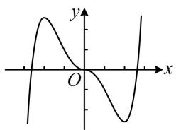
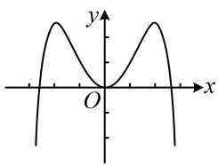
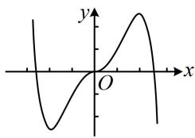
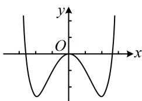

<!-- question-source:start -->
3. (2024·全国甲卷·★★☆)

函数 $y = -x^{2} + (\mathrm{e}^{x} - \mathrm{e}^{-x})\sin x$ 在区间[-2.8,2.8]的图象大致为（）

  
A

  
C

B  
  
D
<!-- question-source:end -->

![[Q00049848A1]]
