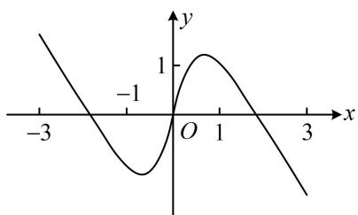

<!-- question-source:start -->
4. (2022·全国乙卷·★★★)

右图是下列四个函数中的某个函数在 $[-3,3]$ 的大致图象，则该函数是（）A. $y = \frac{-x^3 + 3x}{x^2 + 1}$ B. $y = \frac{x^3 - x}{x^2 + 1}$ C. $y = \frac{2x\cos x}{x^2 + 1}$ D. $y = \frac{2\sin x}{x^2 + 1}$

<!-- question-source:end -->

![[Q00049849A1]]
