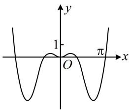
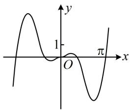
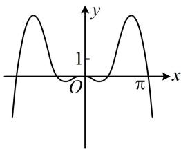
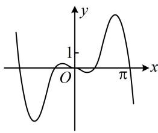

> [!faq]- 《第2节 选解析式与选图象》参考答案
>
> > [!success]- **【答案】** 详见解析
>
> > [!note]- **【分析】**
> > 本题未单列分析。
>
> > [!note]- **【解析】**
> > (2023·山东烟台模拟·★★)
> >
> > 函数 $y = x(\sin x - \sin 2x)$ 的部分图象大致为（）
> >
> >   
> > A
> >
> > 
> >
> >   
> > C
> >
> > B  
> >   
> > D
