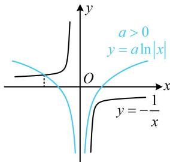
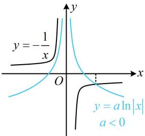

> [!faq]- 《第2节 选解析式与选图象》参考答案
>
> > [!success]- **【答案】** B
>
> > [!note]- **【分析】**
> > 本题未单列分析。
>
> > [!note]- **【解析】**
> > D
> >
> > 解法1：当 $a = 0$ 时， $f(x) = \frac{1}{x}$ ， $f(x)$ 的图象为A项，
> >
> > 而当 $a \neq 0$ 时，观察发现B、C有零点，D没有零点，故可尝试分析 $f(x)$ 的零点情况，来排除选项，
> >
> > 当 $a \neq 0$ 时， $f(x) = 0 \Leftrightarrow a \ln |x| + \frac{1}{x} = 0 \Leftrightarrow a \ln |x| = -\frac{1}{x}$ ，
> >
> > 若 $a > 0$ ，如图1， $y = a\ln |x|$ 和 $y = -\frac{1}{x}$ 在 $y$ 轴左侧必有一个交点，所以 $f(x)$ 在 $(-\infty ,0)$ 上必有一个零点，若 $a < 0$ ，如图2， $y = a\ln |x|$ 和 $y = -\frac{1}{x}$ 在 $y$ 轴右侧必有一个交点，所以 $f(x)$ 在 $(0, + \infty)$ 上必有一个零点，所以 $f(x)$ 始终有零点 $\Rightarrow f(x)$ 的图象不可能是D选项.
> >
> >   
> > 图1
> >
> >   
> > 图2
> >
> > 解法2： $a = 0$ 的分析方法同解法1， $a\neq 0$ 时，选项B、C、D的图象往 $x$ 轴正向的趋势不同，故也可用极限来分析，若 $a > 0$ ，则当 $x\to +\infty$ 时， $f(x) = a\ln |x| + \frac{1}{x}\rightarrow +\infty$
> >
> > 若 $a < 0$ ，则当 $x \to +\infty$ 时， $f(x) = a \ln |x| + \frac{1}{x} \to -\infty$ ；
> >
> > 而对于D项，当 $x\to +\infty$ 时， $f(x)\rightarrow 0$
> >
> > 与上述结果不符，所以图象不可能是D选项.
> >
> > 一数·必刷100讲
