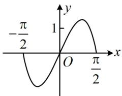
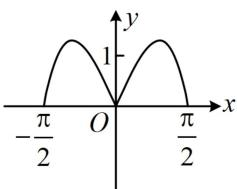
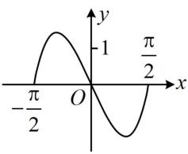
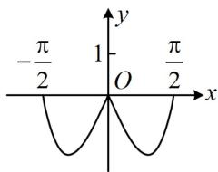

<!-- question-source:start -->
【例1】（2022·全国甲卷）函数 $y = (3^{x} - 3^{-x})\cos x$ 在区间 $\left[-\frac{\pi}{2},\frac{\pi}{2}\right]$ 的大致图象为（）

C  

A

  
B

D
<!-- question-source:end -->

![[高中/总复习/教辅/一数常规版2026/第3章 函数与导数/模块2：函数三类基本题型/第2节 选解析式与选图象/类型01_给解析式选图象/例题/answers/Q00049842A1.md]]
