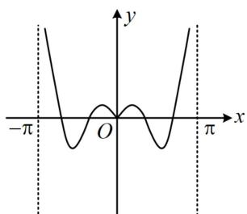
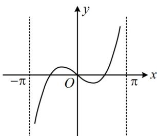
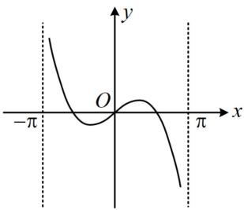
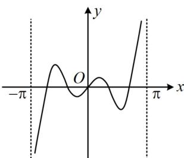

<!-- question-source:start -->
【例2】函数 $f(x) = \frac{\sin 3x}{1 + \cos x} (-\pi < x < \pi)$ 的大致图象为（）

A

B

C

D
<!-- question-source:end -->

![[高中/总复习/教辅/一数常规版2026/第3章 函数与导数/模块2：函数三类基本题型/第2节 选解析式与选图象/类型01_给解析式选图象/例题/answers/Q00049843A1.md]]
