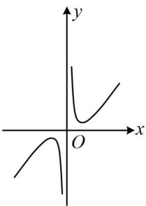
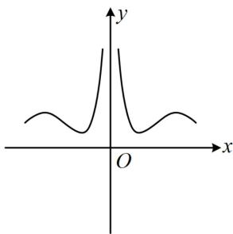
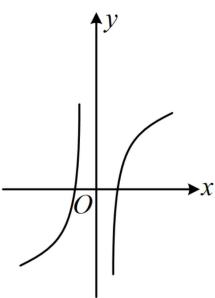
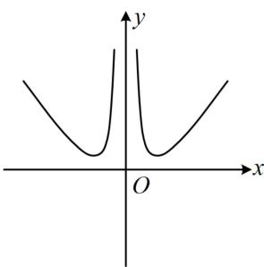

<!-- question-source:start -->
【例3】函数 $f(x) = \frac{|x|x^2 - \ln|x|}{x^2}$ 的大致图象为（）

  
A

  
B

  
C

  
D
<!-- question-source:end -->

![[高中/总复习/教辅/一数常规版2026/第3章 函数与导数/模块2：函数三类基本题型/第2节 选解析式与选图象/类型01_给解析式选图象/例题/answers/Q00049844A1.md]]
