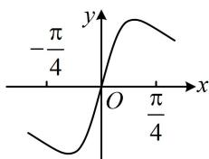

<!-- question-source:start -->
【例4】(2021·浙江卷)已知函数 $f(x) = x^{2} + \frac{1}{4}$ ， $g(x) = \sin x$ ，则图象为右图的函数可能是（）A. $y = f(x) + g(x) - \frac{1}{4}$ B. $y = f(x) - g(x) - \frac{1}{4}$ C. $y = f(x)g(x)$ D. $y = \frac{g(x)}{f(x)}$

<!-- question-source:end -->

![[高中/总复习/教辅/一数常规版2026/第3章 函数与导数/模块2：函数三类基本题型/第2节 选解析式与选图象/类型02_给图象选解析式/例题/answers/Q00049845A1.md]]
