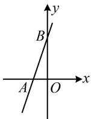

> [!faq]- 《第1节 函数图象切线的计算》参考答案
>
> > [!success]- **【答案】** A
>
> > [!note]- **【分析】**
> > 本题未单列分析。
>
> > [!note]- **【解析】**
> > 解析：$f'(x)=\frac{(e^{x}+2\cos x)(1+x^{2})-2x(e^{x}+2\sin x)}{(1+x^{2})^{2}}$
> >
> > 所以 $f'(0)=3$ ，又因为 $f(0)=1$ ，所以 $f(x)$ 在 $(0,1)$ 处的切线方程为 $y-1=3(x-0)$ ，即 $y=3x+1$ ①，在①中令 y=0 得 $3x+1=0$ ，所以 $x=-\frac{1}{3}$ ，
> > 故该直线与 x 轴的交点为 $A\left(-\frac{1}{3},0\right)$ ,
> > 在①中令 x=0 得 y=1，故该直线与 y 轴的交点为 $B(0,1)$ ，
> > 如图， $S_{\triangle AOB}=\frac{1}{2}|OA|\cdot|OB|=\frac{1}{2}\times\frac{1}{3}\times1=\frac{1}{6}$
> >
> > 
