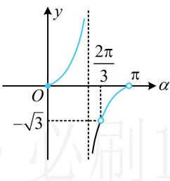

> [!faq]- 《第1节 函数图象切线的计算》参考答案
>
> > [!success]- **【答案】** D
>
> > [!note]- **【分析】**
> > 本题未单列分析。
>
> > [!note]- **【解析】**
> > D
> >
> > 解析：要求切线倾斜角的范围，可先求切线斜率的范围，而切线斜率即为导数，由题意，切线的斜率 $k = f'(x) = \frac{1}{2}\mathrm{e}^x -\sqrt{3} > - \sqrt{3}$ 设切线的倾斜角为 $\alpha (0\leq \alpha <  \pi)$ ，则 $k = \tan \alpha > - \sqrt{3}$ 要由此求 $\alpha$ 的范围，可画正切函数 $y = \tan \alpha$ 的图象来看，如图，在 $[0,\pi)$ 内，满足 $\tan \alpha > - \sqrt{3}$ 的 $\alpha$ 的取值范围是 $\left[0,\frac{\pi}{2}\right)\cup \left(\frac{2\pi}{3},\pi\right).$
> >
> > 
