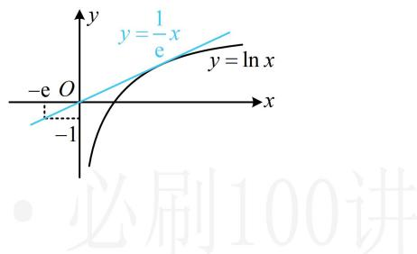
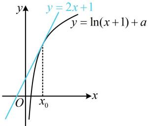

> [!faq]- 《第1节 函数图象切线的计算》参考答案
>
> > [!success]- **【答案】** $\ln 2$
>
> > [!note]- **【分析】**
> > 本题未单列分析。
>
> > [!note]- **【解析】**
> > 解析：$y = \mathrm{e}^{x} + x\Rightarrow y^{\prime} = \mathrm{e}^{x} + 1\Rightarrow y^{\prime}\mid_{x = 0} = \mathrm{e}^{0} + 1 = 2$
> >
> > 所以 $y = \mathrm{e}^{x} + x$ 在(0,1)处的切线方程为 $y - 1 = 2(x - 0)$
> >
> > 即 $y = 2x + 1$ ，由题意，该直线与 $y = \ln (x + 1) + a$ 也相切，
> >
> > 知道相切，但不知道切点，可考虑设切点横坐标，再翻译切点处满足的条件，
> >
> > $$
> > x _ {0}, \quad y = \ln (x + 1) + a \Rightarrow y ^ {\prime} = \frac {1}{x + 1}
> > $$
> >
> > 如图， \(\left\{ \begin{array}{l}\ln (x\_0 + 1) + a = 2x\_0 + 1\) ① \((x\_0\) 处是切线与曲线的交点）\\ \frac{1}{x\_0 + 1} = 2\) ② \((x\_0\) 处的导数等于切线斜率） \(\quad ,\)
> >
> > 由②可得 $x_0 = -\frac{1}{2}$ ，代入①得 $\ln \left(-\frac{1}{2} + 1\right) + a = 2 \times \left(-\frac{1}{2}\right) + 1$ ，
> >
> > $$
> > a = - \ln \frac {1}{2} = \ln 2
> > $$
> >
> > 
> >
> > 
