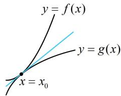

> [!faq]- 《第1节 函数图象切线的计算》参考答案
>
> > [!success]- **【答案】** 5
>
> > [!note]- **【分析】**
> > 本题未单列分析。
>
> > [!note]- **【解析】**
> > 解析：如图，两曲线在公共点处切线相同，可从公共点处的函数值、导数值两方面来翻译，建立方程组求 $m$
> >
> > 设两曲线公共点的横坐标为 $x_0$ ，由题意， $f^{\prime}(x) = 2x$
> >
> > $g^{\prime}(x) = \frac{6}{x} -4$ ，因为两曲线在公共点处切线相同，
> >
> > 所以 $\left\{\begin{aligned}f(x_{0})&=g(x_{0})(x_{0}\text{处是公共点})\\ f'(x_{0})&=g'(x_{0})(x_{0}\text{处切线斜率相同})\end{aligned}\right.$
> >
> > 故 $\left\{\begin{aligned}x_{0}^{2}-m=6\ln x_{0}-4x_{0}\\ 2x_{0}=\frac{6}{x_{0}}-4\end{aligned}\right.$ ，解得：m=5。
> >
> > 
