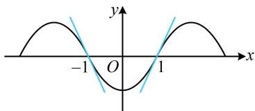

> [!faq]- 《第1节 函数图象切线的计算》参考答案
>
> > [!success]- **【答案】** A
>
> > [!note]- **【分析】**
> > 本题未单列分析。
>
> > [!note]- **【解析】**
> > 解析：计算目标需要 $f(2023)$ 和 $f'(2023)$ ，自变量 $x$ 较大，猜想 $f(x)$ 可能有周期，我们先分析已知条件，看能否找到周期。 $f(3x - 1)$ 为奇函数意味着 $f(x - 1)$ 为奇函数，所以 $f(x)$ 关于点 $(-1,0)$ 对称，下面我们给出严格证明，设 $g(x) = f(3x - 1)$ ，则 $g(x)$ 为奇函数 $\Rightarrow g(-x) = -g(x)$ ，所以 $f(3(-x) - 1) = -f(3x - 1) \Rightarrow f(-3x - 1) + f(3x - 1) = 0$ ，将 $x$ 换成 $\frac{x}{3}$ 可得 $f(-x - 1) + f(x - 1) = 0$ ，所以 $f(x)$ 关于点 $(-1,0)$ 对称，因为 $f(x - 1)$ 关于 $x = 1$ 对称，而 $f(x - 1)$ 是由 $f(x)$ 右移1个单位得到的，所以 $f(x)$ 关于直线 $x = 0$ 对称，结合 $f(x)$ 关于点 $(-1,0)$ 对称可得 $f(x)$ 是以4为周期的周期函数，所以 $f(2023) = f(4 \times 506 - 1) = f(-1)$ ，怎样求 $f(-1)$ ？注意到 $(-1,0)$ 是对称中心，故可通过对 $f(-x - 1) + f(x - 1) = 0$ 赋值求 $f(-1)$ ，在 $f(-x - 1) + f(x - 1) = 0$ 中取 $x = 0$ 得 $f(-1) + f(-1) = 0$ ，所以 $f(-1) = 0$ ，故 $f(2023) = 0$ ，还差 $f'(2023)$ ，可以想象， $f'(x)$ 与 $f(x)$ 应有相同的周期，下面我们先给出推导，因为 $f(x)$ 周期为4，所以 $f(x + 4) = f(x)$ ，两端求导得 $f'(x + 4) = f'(x)$ ，所以 $f'(x)$ 周期也为4，故 $f'(2023) = f'(-1)$ ，题干给出的是 $x = 1$ 处的切线斜率，即 $f'(1)$ ，怎样求 $f'(-1)$ ？注意到 $f(x)$ 关于 $x = 0$ 对称，可以想象，其图象上关于 $y$ 轴对称的两个点处的切线斜率必然相反（如图），下面我们也给出代数层面的推导，因为 $f(x)$ 关于直线 $x = 0$ 对称，所以 $f(x)$ 为偶函数，故 $f(-x) = f(x)$ ，两端求导得 $-f'(-x) = f'(x)$ ，所以 $f'(-x) = -f'(x)$ ，取 $x = 1$ 得 $f'(-1) = -f'(1)$ ，由题意， $f'(1) = 2$ ，所以 $f'(-1) = -2$ ，故曲线 $y = f(x)$ 在 $x = 2023$ 处的切线方程为 $y - f(2023) = f'(2023)(x - 2023)$ ，即 $y - 0 = -2(x - 2023)$ ，整理得： $y = -2x + 4046$ 。
> >
> > 
