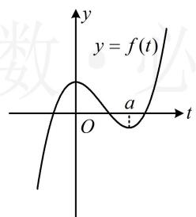
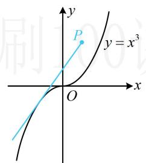
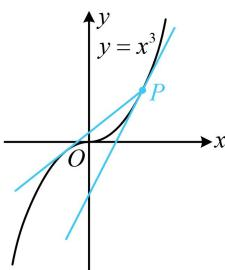
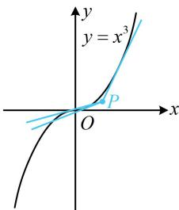
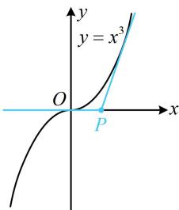
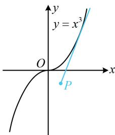

> [!faq]- 《第1节 函数图象切线的计算》参考答案
>
> > [!success]- **【答案】** B
>
> > [!note]- **【分析】**
> > 本题未单列分析。
>
> > [!note]- **【解析】**
> > 解法1：不知道切点，可先设切点，设切点为 $(t,t^3)$ ，因为 $y' = 3x^{2}$ ，所以切线方程为 $y - t^3 = 3t^2 (x - t)$ ，将点 $(a,b)$ 代入整理得： $2t^{3} - 3at^{2} + b = 0$ ，故问题等价于关于 $t$ 的方程 $2t^3 -3at^2 +b = 0$ 有3个实数解，该方程无法直接解，可将 $t$ 看成自变量，构造函数分析，设 $f(t) = 2t^3 -3at^2 +b$ ，则 $f(t)$ 有3个零点，又 $f^{\prime}(t) = 6t^{2} - 6at = 6t(t - a)$ 且 $a > 0$ ，所以 $f^{\prime}(t) > 0\Leftrightarrow t <   0$ 或 $t > a$ ， $f^{\prime}(t) <   0\Leftrightarrow 0 <   t <   a$ 故 $f(t)$ 在 $(- \infty ,0)$ 上 $\nearrow$ ，(0,a)上 $\searrow$ ， $(a, + \infty)$ 上 $\nearrow$ 要使 $f(t)$ 有3个零点，则 $f(t)$ 的大致图象如图1，由图可知 $\left\{ \begin{array}{l}f(0) = b > 0\\ f(a) = b - a^3 <  0 \end{array} \right.$ ，故 $0 <   b <   a^3$
> >
> > 解法2：所给曲线不复杂，也可考虑画图观察．由于曲线 $y = x^{3}$ 和 $x$ 轴将 $y$ 轴右侧区域分成5个部分，故分别考虑，当点 $P$ 在曲线 $y = x^{3}$ 上方时，如图2，
> >
> > 过点 $P$ 只能作1条切线，不合题意；
> >
> >   
> > 图1
> >
> >   
> > 图2
> >
> > 当点 $P$ 在曲线 $y = x^3$ 上时，如图3，
> >
> > 过点 $P$ 只能作2条切线，不合题意；
> >
> > 当点 $P$ 在曲线 $y = x^3$ 与 $x$ 轴之间时，如图4，
> >
> > 过点 $P$ 可作3条切线，满足题意，此时，点 $P$ 的纵坐标 $b$ 应大于0且小于 $y = x^3$ 在 $x = a$ 处的函数值，故 $0 < b < a^3$
> >
> > 
> >
> > 当点 P 在 x 轴上时，如图 5，
> > 过点 P 只能作 2 条切线，不合题意；
> > 当点 P 在 x 轴下方时，如图 6，
> > 过点 P 只能作 1 条切线，不合题意.
> >
> > 图3  
> >   
> > 图4
> >
> >   
> > 图5
> >
> >   
> > 图6
>
> > [!tip]- **【反思】**
> > 对比两个解法会发现，解法2比解法1更直观，计算量更小，像这种研究过某点可作某函数图象几条切线的问题，若函数的图象较为简单，则画图分析往往是优越的解法.
