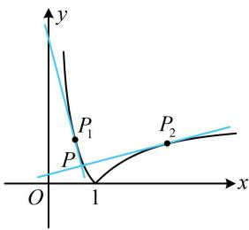

> [!faq]- 《第1节 函数图象切线的计算》参考答案
>
> > [!success]- **【答案】** D
>
> > [!note]- **【分析】**
> > 本题未单列分析。
>
> > [!note]- **【解析】**
> > ## 10.（2022·浙江金华期末·★★★★）
> >
> > 已知函数 $f(x) = |\ln x|$ 的图象在点 $(x_{1}, f(x_{1}))$ 与 $(x_{2}, f(x_{2}))$ 处的切线互相垂直且交于点 $P(x_{0}, y_{0})$ ，则（）A. $x_{1}x_{2} = -1$ B. $x_{1}x_{2} = e$ C. $x_{0} = \frac{x_{1} + x_{2}}{2}$ D. $x_{0} = \frac{2}{x_{1} + x_{2}}$
> >
> > 解析：先画图看看两个切点的位置，如图，要使两切线垂直，则两个切点分别在 $(0,1)$ 和 $(1, +\infty)$ 上，因为 $f(x) = |\ln x|$ ，所以 $f(x) = \begin{cases} -\ln x, & 0 < x < 1 \\ \ln x, & x \geq 1 \end{cases}$ ，故 $f'(x) = \begin{cases} -\frac{1}{x}, & 0 < x < 1 \\ \frac{1}{x}, & x > 1 \end{cases}$ ，不妨设 $P_{1}(x_{1}, -\ln x_{1})$ ， $P_{2}(x_{2}, \ln x_{2})$ ，且 $0 < x_{1} < 1 < x_{2}$ ，要寻找 $x_{1}$ ， $x_{2}$ 的关系，可翻译切线垂直这一条件，因为两切线互相垂直，所以 $f'(x_{1}) f'(x_{2}) = -\frac{1}{x_{1}} \cdot \frac{1}{x_{2}} = -1$ ，从而 $x_{1} x_{2} = 1$ ，故选项A、B均错误；
> >
> > 要判断C、D两个选项，得求出两切线的交点 $P$ 的横坐标 $x_0$ ，可写出两切线的方程，联立求解，点 $P_{1}$ 处的切线方程为 $y - (-\ln x_1) = -\frac{1}{x_1} (x - x_1)$ 整理得： $y = -\frac{1}{x_1} x + 1 - \ln x_1$ ①，  
> > 点 $P_{2}$ 处的切线方程为 $y - \ln x_{2} = \frac{1}{x_{2}} (x - x_{2})$ 整理得： $y = \frac{1}{x_2} x + \ln x_2 - 1$ ②，  
> > 联立①②解得： $x = (2 - \ln x_1 - \ln x_2)\frac{x_1x_2}{x_1 + x_2}$ 结合 $x_{1}x_{2} = 1$ 可得 $x = \frac{2}{x_1 + x_2}$ ，即 $x_0 = \frac{2}{x_1 + x_2}$ ，故选D.
> >
> > 
