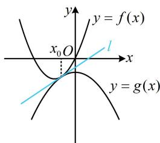
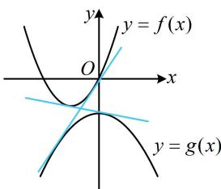
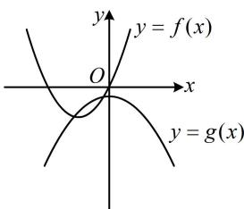

> [!faq]- 《第1节 函数图象切线的计算》参考答案
>
> > [!success]- **【答案】** 详见解析
>
> > [!note]- **【分析】**
> > 本题未单列分析。
>
> > [!note]- **【解析】**
> > $-\frac{1}{2}$
> >
> > 解法1：公切线与两个函数的切点不知道，故考虑设切点，分别写出公切线的斜截式方程，比较系数建立方程组求 $a$ 设直线 $l$ 与 $f(x)$ 相切于点 $A(x_{1},x_{1}^{2} + 2x_{1})$ ，与 $g(x)$ 相切于点 $B(x_{2}, - x_{2}^{2} + a)$ ，由题意， $f^{\prime}(x) = 2x + 2$ ， $g^{\prime}(x) = -2x$ ， $f(x)$ 在 $A$ 处的切线方程为 $y - (x_1^2 + 2x_1) = (2x_1 + 2)(x - x_1)$ ，化简得： $y = (2x_{1} + 2)x - x_{1}^{2}$ ①， $g(x)$ 在 $B$ 处的切线方程为 $y - (-x_2^2 + a) = -2x_2(x - x_2)$ ，化简得： $y = -2x_{2}x + x_{2}^{2} + a$ ②，
> >
> > 注意到①②都是切线 $l$ 的斜截式方程，那么它们的对应系数必定相等，由此可建立方程组分析，
> >
> > 由①②可知 $\left\{\begin{aligned}&2x_{1}+2=-2x_{2}\quad③\\&-x_{1}^{2}=x_{2}^{2}+a\quad④\end{aligned}\right.$ ，由③得 $x_{2}=-x_{1}-1$ ，
> >
> > 代入④整理得： $2x_{1}^{2}+2x_{1}+1+a=0$ ⑤，
> >
> > 因为 $f(x)$ 和 $g(x)$ 只有1条公切线，所以方程⑤有唯一的实数解，故 $\Delta = 2^{2} - 4 \times 2 \times (1 + a) = -4 - 8a = 0 \Rightarrow a = -\frac{1}{2}$ .
> >
> > 解法2：注意到 $f(x)$ 和 $g(x)$ 都是二次函数，其图象比较简单，故也可尝试画图分析，
> >
> > 要使两函数有且仅有1条公切线，则两函数图象的位置关系只能是图1，不能是图2（2条公切线）或图3（无公切线），所以 $f(x)$ 和 $g(x)$ 的图象有唯一的公共点，且公共点处切线相同，设公共点的横坐标为 $x_0$ ，
> >
> > 则 $\left\{ \begin{array}{l}x_0^2 + 2x_0 = -x_0^2 + a (\text{在公共点} x_0 \text{处的函数值相等}) \\ 2x_0 + 2 = -2x_0 (x_0 \text{处切线斜率相等}) \end{array} \right.$
> >
> > 解得： $a = -\frac{1}{2}$
> >
> >   
> > 图1
> >
> >   
> > 图2
> >
> >   
> > 图3
