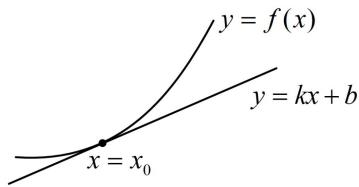
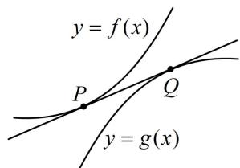

<!-- source-part:1 pages:1-7 -->

# 模块三 导数常规题型

## 第1节 函数图象切线的计算（★★☆）

## 内容提要

函数的切线方程相关计算在高考中主要有以下几类题型：

1. 求曲线 $y = f(x)$ 在点 $P(x_0, f(x_0))$ 处的切线：切线的斜率 $k = f'(x_0)$ ，结合切点坐标可知切线的方程为 $y - f(x_0) = f'(x_0)(x - x_0)$ .

2. 求曲线 $y = f(x)$ 过点 $Q(m, n)$ 的切线：由于不知道切点坐标，故需设切点为 $P(x_0, f(x_0))$ ，写出切线方程为 $y - f(x_0) = f'(x_0)(x - x_0)$ ，将点 $Q(m, n)$ 代入得到 $n - f(x_0) = f'(x_0)(m - x_0)$ ，由此方程解出 $x_0$ ，得到切点坐标，即可求出切线的方程.

3. 已知直线 $y = kx + b$ 与函数 $y = f(x)$ 的图象相切求参（参数在直线上或在 $f(x)$ 解析式中）：这类问题的处理方法是：如图1，设切点横坐标为 $x_0$ ，可从切线斜率即为 $f'(x_0)$ 以及切点为切线与函数图象交点两方面建立方程组 $\begin{cases} k = f'(x_0) \\ kx_0 + b = f(x_0) \end{cases}$ ，解此方程组即可求出参数的值.

4. 两个函数 $y = f(x)$ 和 $y = g(x)$ 的图象有公切线：如图2，这类题一般先设公切线与两个图象的切点分别为 $P(x_{1},f(x_{1}))$ ， $Q(x_{2},g(x_{2}))$ ，再写出 $f(x)$ 在点 $P$ 处和 $g(x)$ 在点 $Q$ 的切线方程，比较系数建立方程组，研究方程组解的情况.

  
图1

  
图2

![[高中/总复习/教辅/一数常规版2026/第3章 函数与导数/模块3：导数常规题型/第1节 函数图象切线的计算/类型01_求函数在某点处的切线/类型01_求函数在某点处的切线.md]]
![[高中/总复习/教辅/一数常规版2026/第3章 函数与导数/模块3：导数常规题型/第1节 函数图象切线的计算/类型02_求函数过某点的切线/类型02_求函数过某点的切线.md]]
![[高中/总复习/教辅/一数常规版2026/第3章 函数与导数/模块3：导数常规题型/第1节 函数图象切线的计算/类型03_已知某直线与函数相切求参/类型03_已知某直线与函数相切求参.md]]
![[高中/总复习/教辅/一数常规版2026/第3章 函数与导数/模块3：导数常规题型/第1节 函数图象切线的计算/类型04__此类型较难__两个函数图象不同切点的公切线问题/类型04__此类型较难__两个函数图象不同切点的公切线问题.md]]
![[高中/总复习/教辅/一数常规版2026/第3章 函数与导数/模块3：导数常规题型/第1节 函数图象切线的计算/强化训练/强化训练.md]]
