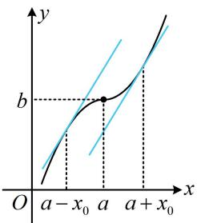
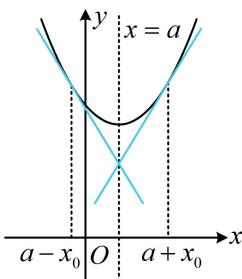

> [!faq]- 《第1节 函数图象切线的计算》例题解析
>
> > [!success]- **【答案】** C
>
> > [!note]- **【分析】**
> > 本题未单列分析。
>
> > [!note]- **【解析】**
> > 解法 1: 奇函数中, 已知 $x < 0$ 时的解析式, 可先求出 $x > 0$ 时的解析式,
> >
> > 由题意，当 $x < 0$ 时， $f(x) = \ln (-2x) + 1$ ，所以当 $x > 0$ 时， $f(x) = -f(-x) = -[\ln (-2(-x)) + 1] = -\ln (2x) - 1$ ，故 $f'(x) = -\frac{1}{2x} \cdot 2 = -\frac{1}{x}$ ，所以 $f'\left(\frac{1}{2}\right) = -2$ ， $f\left(\frac{1}{2}\right) = -1$ ，故所求切线方程为 $y - (-1) = -2\left(x - \frac{1}{2}\right)$ ，即 $y = -2x$ 。解法2：也可直接由 $x < 0$ 的解析式求 $f'\left(-\frac{1}{2}\right)$ ，再用奇函数的对称性得出 $f'\left(\frac{1}{2}\right)$ ，
> >
> > 由题意，当 $x < 0$ 时， $f(x) = \ln (-2x) + 1$
> >
> > 此时， $f^{\prime}(x) = \frac{1}{-2x}\cdot (-2) = \frac{1}{x}$ ，所以 $f^{\prime}\left(-\frac{1}{2}\right) = -2$ 又 $f(x)$ 为奇函数，所以 $f^{\prime}\left(\frac{1}{2}\right) = f^{\prime}\left(-\frac{1}{2}\right) = -2$ ，（原因见反思） $f\left(\frac{1}{2}\right) = -f\left(-\frac{1}{2}\right) = -\left(\ln \left(-2\times \left(-\frac{1}{2}\right)\right) + 1\right) = -1,$
> >
> > 故所求切线的方程为 $y - (-1) = -2\left(x - \frac{1}{2}\right)$ ，整理得： $y = -2x$ .
> >
> >   
> > 图1
> >
> >   
> > 图2
>
> > [!tip]- **【反思】**
> > - **①**：如图1, 若函数的图象关于点 $(a, b)$ 对称, 则图象上关于 $(a, b)$ 对称的两个点处导数值相等;
> > - **②**：如图2, 若函数的图象关于直线 $x = a$ 对称, 则图象上关于 $x = a$ 对称的两个点处, 导数值相反.
