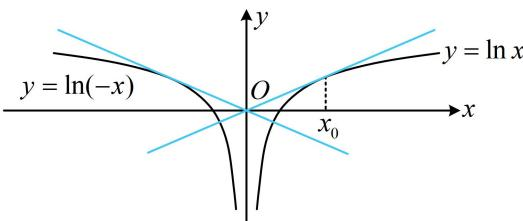

> [!faq]- 《第1节 函数图象切线的计算》例题解析
>
> > [!success]- **【答案】** $y=\frac{1}{e}x,\quad y=-\frac{1}{e}x$
>
> > [!note]- **【分析】**
> > 本题未单列分析。
>
> > [!note]- **【解析】**
> > 解析：曲线 $y = \ln |x|$ 如图，由对称性，可先求该曲线位于 y 轴右侧部分的过原点的切线，此部分的解析式为 $y = \ln x$ ，由于不知道切点，所以设切点为 $(x_{0}, \ln x_{0})$ ，
> >
> > 因为 $(\ln x)' = \frac{1}{x}$ ，所以该切线的方程为 $y - \ln x_0 = \frac{1}{x_0} (x - x_0)$ ，将原点(0,0)代入可得： $-\ln x_0 = \frac{1}{x_0} \cdot (-x_0)$ ，解得： $x_0 = e$ ，故切线方程为 $y - \ln e = \frac{1}{e} (x - e)$ ，整理得： $y = \frac{1}{e} x$ ，由对称性知另一条切线为 $y = -\frac{1}{e} x$ 。
> >
> > 
