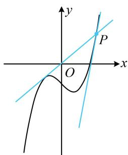

> [!faq]- 《第1节 函数图象切线的计算》例题解析
>
> > [!success]- **【答案】** y=2x 或 y=11x-18
>
> > [!note]- **【分析】**
> > 本题未单列分析。
>
> > [!note]- **【解析】**
> > 解析：不知道切点，先设切点，设切点为 $(x_0, x_0^3 - x_0 - 2)$ ，由题意， $y' = 3x^2 - 1$ ，所以切线方程为 $y - (x_0^3 - x_0 - 2) = (3x_0^2 - 1)(x - x_0)$ ①，将点(2,4)代入得： $4-(x_{0}^{3}-x_{0}-2)=(3x_{0}^{2}-1)(2-x_{0})$ ，整理得： $x_{0}^{3}-3x_{0}^{2}+4=0$ ，解一元三次方程可先试根，观察可得 $x_{0}=-1$ 是上述方程的一个解，那么因式分解就有了方向， $x_{0}^{3}-3x_{0}^{2}+4=x_{0}^{3}+x_{0}^{2}-4x_{0}^{2}+4=x_{0}^{2}(x_{0}+1)-4(x_{0}+1)(x_{0}-1)=(x_{0}+1)(x_{0}-2)^{2}$ 所以 $(x_{0}+1)(x_{0}-2)^{2}=0$ ，解得： $x_{0}=-1$ 或2，
> > 代入式①得所求切线为 y=2x 或 y=11x-18。（两条切线如图）
> >
> >
> > 
>
> > [!tip]- **【反思】**
> > 求函数过某点的切线方程，常按设切点，写出切线方程，将已知点代入求得切点的流程求解.
