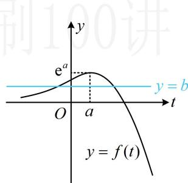
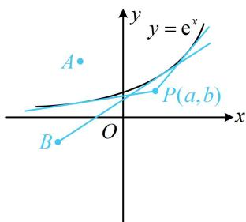

> [!faq]- 《第1节 函数图象切线的计算》例题解析
>
> > [!success]- **【答案】** D
>
> > [!note]- **【分析】**
> > 本题未单列分析。
>
> > [!note]- **【解析】**
> > A. $\mathrm{e}^{b} < a$ B. $\mathrm{e}^{a} < b$ C. $0 < a < \mathrm{e}^{b}$ D. $0 < b < \mathrm{e}^{a}$
> >
> > 解法1：不知道切点，可先设切点，设切点为 $(t, \mathbf{e}^t)$ ，因为 $y' = \mathbf{e}^x$ ，所以切线方程为 $y - \mathbf{e}^t = \mathbf{e}^t(x - t)$ ，将点 $(a, b)$ 代入整理得： $b = \mathbf{e}^t(a + 1 - t)$ ，故问题等价于关于 $t$ 的方程 $b = \mathbf{e}^t(a + 1 - t)$ 有2个实数解，该方程无法直接解，可考虑将 $t$ 看成自变量，构造函数分析，设 $f(t) = \mathbf{e}^t(a + 1 - t)$ ，则 $f'(t) = \mathbf{e}^t(a - t)$ ，所以 $f'(t) > 0 \Leftrightarrow t < a$ ， $f'(t) < 0 \Leftrightarrow t > a$ ，故 $f(t)$ 在 $(- \infty, a)$ 上 $\nearrow$ ，在 $(a, +\infty)$ 上 $\searrow$ ，又 $f(a) = \mathbf{e}^a$ ， $\lim_{t \to -\infty} f(t) = 0$ ， $\lim_{t \to +\infty} f(t) = -\infty$ ，所以 $y = f(t)$ 的大致图象如图1，
> >
> > 方程 $b = \mathrm{e}^{t}(a + 1 - t)$ 有2个实数解等价于直线 $y = b$ 与 $y = f(t)$ 的图象有2个交点，由图可知 $0 < b < \mathrm{e}^{a}$ .
> > 解法2：观察选项B、D可发现，它们分别表示点 $(a, b)$ 在曲线 $y = \mathrm{e}^{x}$ 上方和点 $(a, b)$ 在曲线 $y = \mathrm{e}^{x}$ 与 $x$ 轴之间，故也可考虑直接画图分析怎样能过点 $(a, b)$ 作出曲线 $y = \mathrm{e}^{x}$ 的两条切线，
> > - **①**：对于曲线 $y = e^{x}$ 上方的点，如图 2 中的点 A，作不出过点 A 的切线；
> > - **②**：对于曲线 $y = \mathrm{e}^{x}$ 上的点，显然只能作1条切线；
> > - **③**：对于曲线 $y = \mathrm{e}^{x}$ 和 $x$ 轴之间的点，如图2的 $P(a, b)$ ，过 $P$ 可作2条切线，此时，点 $P$ 的纵坐标 $b$ 应大于0且小于 $y = \mathrm{e}^{x}$ 在 $x = a$ 处的函数值，所以 $0 < b < \mathrm{e}^{a}$ ；
> > - **④**：对于 $x$ 轴上或 $x$ 轴下方的点，如图2中的点 $B$ ，只能作1条切线；
> >
> > 
> >
> > 
> >
> > 综上所述， $0 < b < e^{a}$
> >
> > 图1
> >
> >
> > 图2
>
> > [!tip]- **【反思】**
> > 数形结合是一种重要的数学思想，像这种研究过某点可作某函数图象几条切线的问题，若函数的图象较为简单，则画图分析往往是优越的解法.
