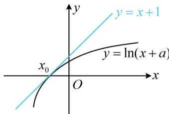

> [!faq]- 《第1节 函数图象切线的计算》例题解析
>
> > [!success]- **【答案】** 2
>
> > [!note]- **【分析】**
> > 本题未单列分析。
>
> > [!note]- **【解析】**
> > 解析：已知切线求参，用内容提要3的方法，
> >
> > $y = \ln (x + a)\Rightarrow y^{\prime} = \frac{1}{x + a}$ ，设切点横坐标为 $x_0$
> >
> > 如图， $\left\{ \begin{array}{l} \frac{1}{x_0 + a} = 1 \\ x_0 + 1 = \ln (x_0 + a) \end{array} \right.$ ①（ $x_0$ 处的导数与切线斜率相等），
> >
> > 由①可得 $x_0 + a = 1$ ，代入②可解得： $x_0 = -1$ ，所以 $a = 1 - x_0 = 2$
> >
> > 
>
> > [!tip]- **【总结】**
> > 已知直线与函数图象相切求参这类问题，常抓住切点处导数等于切线斜率、切点是切线与函数图象交
> >
> > 点这两方面来建立方程组求解参数.
