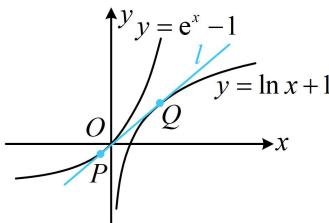

> [!faq]- 《第1节 函数图象切线的计算》例题解析
>
> > [!success]- **【答案】** $y = \mathrm{e}x - 1$ 或 $y = x$
>
> > [!note]- **【分析】**
> > 本题未单列分析。
>
> > [!note]- **【解析】**
> > 解析：直线 $l$ 与两曲线的切点均未知，可设两个切点，分别写出切线 $l$ 的方程，比较系数，
> >
> > 如图，设两个切点分别为 $P(x_{1},\mathrm{e}^{x_{1}} - 1)$ ， $Q(x_{2},\ln x_{2} + 1)$
> >
> > 因为 $(\mathrm{e}^x - 1)' = \mathrm{e}^x$ ，所以 $l$ 的方程为 $y - (\mathrm{e}^{x_1} - 1) = \mathrm{e}^{x_1}(x - x_1)$ ，整理得： $y = \mathrm{e}^{x_1}x + (1 - x_1)\mathrm{e}^{x_1} - 1$ ①，
> >
> > 又 $(\ln x + 1)' = \frac{1}{x}$ ，所以 $l$ 的方程为 $y - (\ln x_2 + 1) = \frac{1}{x_2} (x - x_2)$ ，整理得： $y = \frac{1}{x_2} x + \ln x_2$ ②，
> >
> > 由于①和②都是切线 l 的方程，所以 $\left\{\begin{aligned}\mathrm{e}^{x_{1}}&=\frac{1}{x_{2}}\\ (1-x_{1})\mathrm{e}^{x_{1}}&-1=\ln x_{2}\end{aligned}\right.$ ③，
> >
> > 由③可得 $x_{2} = \mathrm{e}^{-x_{1}}$ ，代入④得： $(1 - x_{1})\mathrm{e}^{x_{1}} - 1 = \ln \mathrm{e}^{-x_{1}}$
> >
> > 化简得： $(x_{1} - 1)(\mathrm{e}^{x_{1}} - 1) = 0$ ，解得： $x_{1} = 1$ 或0，
> >
> > 
> >
> > 代入①得直线 l 的方程为 y = ex - 1 或 y = x .
>
> > [!tip]- **【反思】**
> > 不同切点处的公切线问题的通用思路：先设两个切点，分别写出切线 $l$ 的方程，再比较系数建立方程组求解或分析解的个数。有时候，列出方程的后续分析会比较复杂，如下面变式。
