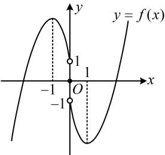

> [!faq]- 《第2节 分析无参函数的单调区间、极值、最值》参考答案
>
> > [!success]- **【答案】** ABD
>
> > [!note]- **【分析】**
> > 本题未单列分析。
>
> > [!note]- **【解析】**
> > ABD
> >
> > 解析：A项，因为 $f(x)$ 是定义在 $\mathbf{R}$ 上的奇函数，  
> > 所以 $f(0) = 0$ ，故A项正确；  
> > B项，给的是 $x > 0$ 的解析式，怎样求 $x < 0$ 的解析式？注意到当 $x < 0$ 时， $-x > 0$ ，而 $f(x) = -f(-x)$ ，且 $f(-x)$ 能代所给解析式计算，故由此可求得当 $x < 0$ 时的 $f(x)$ 当 $x < 0$ 时， $-x > 0$ ，所以 $f(-x) = [(-x)^2 -3]\mathrm{e}^{-x} + 2$ $= (x^{2} - 3)\mathrm{e}^{-x} + 2$ ，从而 $f(x) = -f(-x) = -(x^2 -3)\mathrm{e}^{-x} - 2$ 故B项正确；  
> > C项，要解不等式 $f(x)\geq 2$ ，可以分 $x > 0$ ， $x < 0$ 讨论，但偏麻烦，不妨直接研究 $f(x)$ ，画出草图来看．考虑到 $f(x)$ 的图象关于原点对称，故只需研究当 $x > 0$ 时的图象，下面我们求导分析，
> >
> > 当 $x > 0$ 时， $f'(x) = 2xe^x + (x^2 - 3)e^x = (x^2 + 2x - 3)e^x$
> >
> > $$
> > = (x + 3) (x - 1) \mathrm{e} ^ {x},
> > $$
> >
> > 所以 $f^{\prime}(x) < 0 \Leftrightarrow 0 < x < 1$ ， $f^{\prime}(x) > 0 \Leftrightarrow x > 1$
> >
> > 故 $f(x)$ 在 $(0,1)$ 上 $\searrow$ ，在 $(1, +\infty)$ 上 $\nearrow$
> >
> > 又 $f(1) = 2 - 2\mathrm{e}$ ， $\lim_{x\to 0^{+}}f(x) = -1$ ， $\lim_{x\to +\infty}f(x) = +\infty$
> >
> > 所以 $f(x)$ 的大致图象如图，
> >
> > 由所给解析式容易得到当 $x > 0$ 时， $f(x) \geq 2 \Leftrightarrow x \geq \sqrt{3}$ ，那在 $x < 0$ 那边 $f(x) \geq 2$ 是否有解呢？结合图形可知只需看看 $f(-1) \geq 2$ 是否成立，若成立，则有解；否则没有解，
> >
> > 因为 $f(-1) = -f(1) = 2\mathrm{e} - 2 > 2$ ，所以在 $(- \infty, 0)$ 上也存在 $x$ 使 $f(x) \geq 2$ ，故C项错误；
> >
> > D 项，由图可知 x = -1 是 $f(x)$ 的极大值点，故 D 项正确.
> >
> > 
