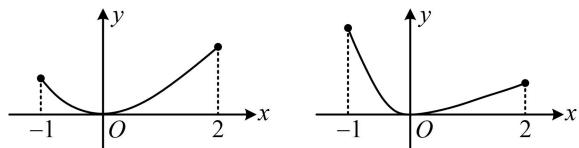

> [!faq]- 《第2节 分析无参函数的单调区间、极值、最值》参考答案
>
> > [!success]- **【答案】** 详见解析
>
> > [!note]- **【分析】**
> > 本题未单列分析。
>
> > [!note]- **【解析】**
> > 解：（1）由题意， $f'(x)=\frac{2x\cdot\mathrm{e}^{x}-x^{2}\cdot\mathrm{e}^{x}}{(\mathrm{e}^{x})^{2}}=\frac{x(2-x)}{\mathrm{e}^{x}}$ ， $x\in\mathbf{R}$ 所以 $f'(x)>0 \Leftrightarrow 0 < x < 2$ ， $f'(x)<0 \Leftrightarrow x<0$ 或 x>2，
> >
> > 故 $f(x)$ 的单调增区间为 $(0,2)$ ，单调减区间为 $(- \infty, 0)$ 和
> >
> > $(2,+\infty)$ .
> >
> > （2）由（1）可知当 $x \in [-1, 2]$ 时， $f(x)$ 在 $[-1, 0]$ 上单调递减，在 $[0, 2]$ 上单调递增，
> >
> > 所以 $f(x)$ 在 $[-1,2]$ 上的最小值为 $f(0) = \frac{0^2}{\mathrm{e}^0} = 0$
> >
> > （最大值在哪里取？如图，有两种可能性，先 $\searrow$ 后 $\nearrow$ 的函数，左右两个端点谁的函数值更大，最大值就是谁）
> >
> > 又因为 $f(-1) = \frac{(-1)^2}{\mathrm{e}^{-1}} = \mathrm{e}$ ， $f(2) = \frac{2^2}{\mathrm{e}^2} = \frac{4}{\mathrm{e}^2}$
> >
> > 所以 $f(-1) > f(2)$ ,
> >
> > 从而 $f(x)$ 在 $[-1,2]$ 上的最大值为 $f(-1) = \mathrm{e}$ ，
> >
> > 故 $f(x)$ 在 $[-1,2]$ 上的值域为 $[0,\mathrm{e}]$ .
> >
> > 
