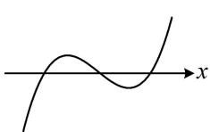
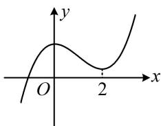

<!-- question-source:start -->
【例1】（多选）已知函数 $f(x) = x^{3} - 3x^{2} + 5$ ，则（）
A. $f(x)$ 有2个极值点
B. $f(x)$ 有3个零点
C. 点(1,3)是曲线 $y = f(x)$ 的对称中心
D. 直线 $y = -3x + 6$ 是曲线 $y = f(x)$ 的切线

(2)=2^{3}-3\times2^{2}+5=1>0$ ，所以本题实际的情况如图 2，
由图可知 $f(x)$ 有且仅有 1 个零点，故 B 项错误；

C 项，要看 (1,3) 是不是对称中心，就看 $f(2 - x) + f(x) = 6$ 是否成立（相关结论见模块一的第 3 节），因为 $f(2 - x) + f(x) = (2 - x)^{3} - 3(2 - x)^{2} + 5 + x^{3} - 3x^{2} + 5 = [(2 - x)^{3} + x^{3}] - 3(4 - 4x + x^{2}) - 3x^{2} + 10 = (2 - x + x)[(2 - x)^{2} - (2 - x)x + x^{2}] - 6x^{2} + 12x - 2 = 2(4 - 4x + x^{2} - 2x + x^{2} + x^{2}) - 6x^{2} + 12x - 2 = 6$ ，

(1) = 3$ ，所以 $f(x)$ 的斜率为-3的切线方程为 $y - 3 = -3(x - 1)$ ，整理得： $y = -3x + 6$ ，故D项正确.

  
图1

  
图2
<!-- question-source:end -->

![[高中/总复习/教辅/一数常规版2026/第3章 函数与导数/模块3：导数常规题型/第2节 分析无参函数的单调区间、极值、最值/类型01_只需求一次导/例题/answers/Q00049882A1.md]]
