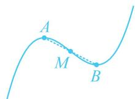

> [!faq]- 《第2节 分析无参函数的单调区间、极值、最值》例题解析
>
> > [!success]- **【答案】** ACD
>
> > [!note]- **【分析】**
> > 本题未单列分析。
>
> > [!note]- **【解析】**
> > A. $f(x)$ 有2个极值点
> > B. $f(x)$ 有3个零点
> > C. 点(1,3)是曲线 $y = f(x)$ 的对称中心
> > D. 直线 $y = -3x + 6$ 是曲线 $y = f(x)$ 的切线
> >
> > 解析：A 项，由题意， $f'(x)=3x^{2}-6x=3x(x-2)$ ，所以 $f'(x)>0\Leftrightarrow x<0$ 或 x>2， $f'(x)<0\Leftrightarrow0<x<2$ ，故 $f(x)$ 在 $(-∞,0)$ 上 $\nearrow$ ，在 $(0,2)$ 上 $\searrow$ ，在 $(2,+∞)$ 上 $\nearrow$ ，所以 $f(x)$ 有 2 个极值点，故 A 项正确；
> > B 项，三次函数有 3 个零点的充要条件是两个极值异号，如图 1，故可通过计算极值来判断零点个数，因为 $f(0)=5>0,\quad f
> > (2)=2^{3}-3\times2^{2}+5=1>0$ ，所以本题实际的情况如图 2，
> > 由图可知 $f(x)$ 有且仅有 1 个零点，故 B 项错误；
> >
> > C 项，要看 (1,3) 是不是对称中心，就看 $f(2 - x) + f(x) = 6$ 是否成立（相关结论见模块一的第 3 节），因为 $f(2 - x) + f(x) = (2 - x)^{3} - 3(2 - x)^{2} + 5 + x^{3} - 3x^{2} + 5 = [(2 - x)^{3} + x^{3}] - 3(4 - 4x + x^{2}) - 3x^{2} + 10 = (2 - x + x)[(2 - x)^{2} - (2 - x)x + x^{2}] - 6x^{2} + 12x - 2 = 2(4 - 4x + x^{2} - 2x + x^{2} + x^{2}) - 6x^{2} + 12x - 2 = 6$ ，
> >
> > 所以点(1,3)是曲线 $y=f(x)$ 的对称中心，故C项正确；
> >
> > D项，直线 $y = -3x + 6$ 的斜率为-3，故只需求出 $f(x)$ 的斜率为-3的切线，与 $y = -3x + 6$ 对比即可，  
> > 令 $f'(x) = -3$ 可得： $3x^{2} - 6x = -3$ ，解得： $x = 1$ ，又 $f
> > (1) = 3$ ，所以 $f(x)$ 的斜率为-3的切线方程为 $y - 3 = -3(x - 1)$ ，整理得： $y = -3x + 6$ ，故D项正确.
> >
> >   
> > 图1
> >
> >   
> > 图2
>
> > [!tip]- **【反思】**
> > 三次函数 $f(x) = ax^3 + bx^2 + cx + d (a \neq 0)$ 必有对称中心 $\left(-\frac{b}{3a}, f\left(-\frac{b}{3a}\right)\right)$ ，特别地，若 $f(x)$ 有极值点，则对称中心恰为图象上极值点处的两个点的中点，如图，熟悉此结论，选项 C 可直接判断.
> >
> > 
