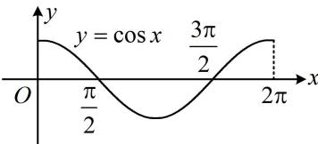

> [!faq]- 《第2节 分析无参函数的单调区间、极值、最值》例题解析
>
> > [!success]- **【答案】** D
>
> > [!note]- **【分析】**
> > 本题未单列分析。
>
> > [!note]- **【解析】**
> > 解析：函数最值显然不易直接看出，式子也不好化简，只能考虑求导分析单调性，
> >
> > 由题意， $f^{\prime}(x) = -\sin x + \sin x + (x + 1)\cos x = (x + 1)\cos x$
> >
> > 当 $x \in [0, 2\pi]$ 时， $x + 1 > 0$ ，所以 $f'(x)$ 的正负与 $\cos x$ 相同，可画出 $y = \cos x$ 在 $[0, 2\pi]$ 上的图象来看，如图， $f'(x) > 0 \Leftrightarrow \cos x > 0 \Leftrightarrow 0 \leq x < \frac{\pi}{2}$ 或 $\frac{3\pi}{2} < x \leq 2\pi$ ， $f'(x) < 0 \Leftrightarrow \cos x < 0 \Leftrightarrow \frac{\pi}{2} < x < \frac{3\pi}{2}$ ，
> >
> > 所以 $f(x)$ 在 $\left[0, \frac{\pi}{2}\right)$ 上 $\nearrow$ ，在 $\left(\frac{\pi}{2}, \frac{3\pi}{2}\right)$ 上 $\searrow$ ，在 $\left(\frac{3\pi}{2}, 2\pi\right]$ 上 $\nearrow$ ，
> > 因为 $f(0) = 2 > f\left(\frac{3\pi}{2}\right) = -\frac{3\pi}{2}$ ，所以 $f(x)_{\min} = -\frac{3\pi}{2}$ ，又 $f\left(\frac{\pi}{2}\right) = \frac{\pi}{2} + 2 > f(2\pi) = 2$ ，所以 $f(x)_{\max} = \frac{\pi}{2} + 2$ 。
> >
> > 
