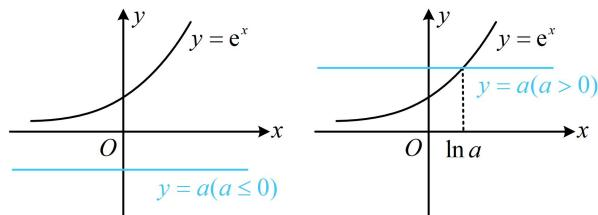

> [!faq]- 《第3节 分析带参函数的单调区间、极值、最值》参考答案
>
> > [!success]- **【答案】** 详见解析
>
> > [!note]- **【分析】**
> > 本题未单列分析。
>
> > [!note]- **【解析】**
> > 解： $f'(x) = \mathrm{e}^{2x} + (2 - a)\mathrm{e}^x - 2a = (\mathrm{e}^x + 2)(\mathrm{e}^x - a)$ ，
> >
> > （观察可知 $f'(x)$ 的符号与 $\mathrm{e}^x - a$ 这个因式的符号相同，该因式是否有零点由 $a$ 的正负决定，如图，故据此讨论）①当 $a \leq 0$ 时， $\mathrm{e}^x - a > 0$ ， $\mathrm{e}^x + 2 > 0$ ，所以 $f'(x) > 0$ ，
> >
> > 故 $f(x)$ 在 $\mathbf{R}$ 上单调递增；
> > - **②**：当 $a > 0$ 时， $f'(x) > 0 \Leftrightarrow x > \ln a$ ， $f'(x) < 0 \Leftrightarrow x < \ln a$
> >
> > 所以 $f(x)$ 在 $(-\infty, \ln a)$ 单调递减，在 $(\ln a, +\infty)$ 单调递增.
> >
> > 
