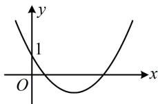
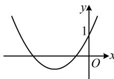
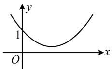
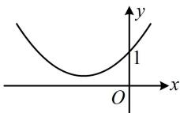

> [!faq]- 《第3节 分析带参函数的单调区间、极值、最值》参考答案
>
> > [!success]- **【答案】** 详见解析
>
> > [!note]- **【分析】**
> > 本题未单列分析。
>
> > [!note]- **【解析】**
> > 解：（1）当 $a = -1$ 时， $f(x) = \ln x + x + x^2$
> >
> > $f'(x)=\frac{1}{x}+1+2x$ ，所以 $f'(1)=4$ ， $f(1)=2$ ，
> >
> > 故 $f(x)$ 在 $(1, f(1))$ 处的切线方程为 $y - 2 = 4(x - 1)$ ，
> >
> > 整理得： $y = 4x - 2$
> >
> > （2）由题意， $f'(x)=\frac{1}{x}-a+2x=\frac{2x^{2}-ax+1}{x}$ ，x>0，
> >
> > (能影响 $f'(x)$ 正负的是分子的二次函数 $y = 2x^{2} - ax + 1$ ，其开口向上，对称轴是 $x = \frac{a}{4}$ ，过定点 $(0,1)$ ，要使其在 $(0,+\infty)$ 上有变号零点，其图象只能是图 1 的情况，其它情形，如图 2、3、4 等，在 $(0,+\infty)$ 上，都有 $2x^{2} - ax + 1 \geq 0$ ，可统一讨论。而对于图 1，应有 $\Delta = a^{2} - 8 > 0$ 且对称轴 $x = \frac{a}{4}$ 在 y 轴右侧，两者结合可得 $a > 2\sqrt{2}$ ，故就分 $a > 2\sqrt{2}$ 和 $a \leq 2\sqrt{2}$ 两种情况讨论）
> >
> > 
> >
> > 
> >
> > 图1  
> >   
> > 图3
> >
> > 图2  
> >   
> > 图4
> >
> > (i)当 $a > 2\sqrt{2}$ 时，令 $f^{\prime}(x) = 0$ 得 $2x^{2} - ax + 1 = 0$
> >
> > 解得： $x = \frac{a\pm\sqrt{a^2 - 8}}{4}$ ，且 $\frac{a + \sqrt{a^2 - 8}}{4} >\frac{a - \sqrt{a^2 - 8}}{4} >0$
> >
> > 所以 $f^{\prime}(x) > 0\Leftrightarrow 0 <   x <   \frac{a - \sqrt{a^{2} - 8}}{4}$ 或 $x > \frac{a + \sqrt{a^2 - 8}}{4},$
> >
> > $$
> > f ^ {\prime} (x) <   0 \Leftrightarrow \frac {a - \sqrt {a ^ {2} - 8}}{4} <   x <   \frac {a + \sqrt {a ^ {2} - 8}}{4},
> > $$
> >
> > 故 $f(x)$ 在 $\left(0, \frac{a - \sqrt{a^2 - 8}}{4}\right)$ , $\left(\frac{a + \sqrt{a^2 - 8}}{4}, +\infty\right)$ 单调递增, 在 $\left(\frac{a - \sqrt{a^2 - 8}}{4}, \frac{a + \sqrt{a^2 - 8}}{4}\right)$ 单调递减;
> >
> > (ii)当 $a \leq 2\sqrt{2}$ 时， $2x^{2} - ax + 1 \geq 2x^{2} - 2\sqrt{2}x + 1 = (\sqrt{2}x - 1)^{2}$
> >
> > ≥0，所以 $f'(x) \geq 0$ ，故 $f(x)$ 在 $(0, +\infty)$ 上单调递增.
