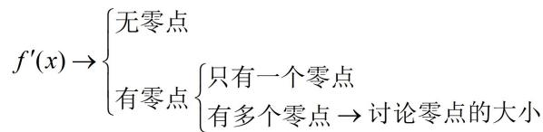

<!-- source-part:1 pages:1-5 -->

# 第3节 分析带参函数的单调区间、极值、最值（★★★）

内容提要

本节来学习分析带参函数的方法. 当函数解析式中有参数时, 分析函数的单调区间往往需要讨论, 这类题函数可能千变万化, 但本质上讨论的流程可归纳为如下的流程图:

![[高中/总复习/教辅/一数常规版2026/第3章 函数与导数/模块3：导数常规题型/第3节 分析带参函数的单调区间、极值、最值/类型01__f__x___最多一个零点/类型01__f__x___最多一个零点.md]]
![[高中/总复习/教辅/一数常规版2026/第3章 函数与导数/模块3：导数常规题型/第3节 分析带参函数的单调区间、极值、最值/类型02__f__x___多个零点的讨论/类型02__f__x___多个零点的讨论.md]]
![[高中/总复习/教辅/一数常规版2026/第3章 函数与导数/模块3：导数常规题型/第3节 分析带参函数的单调区间、极值、最值/强化训练/强化训练.md]]
