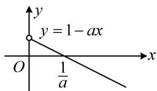

> [!faq]- 《第3节 分析带参函数的单调区间、极值、最值》例题解析
>
> > [!success]- **【答案】** 详见解析
>
> > [!note]- **【分析】**
> > 本题未单列分析。
>
> > [!note]- **【解析】**
> > 解：由题意， $f'(x)=\frac{1}{x}-a=\frac{1-ax}{x}(x>0)$ ,
> >
> > (由 $f'(x)=0$ 可得 $x=\frac{1}{a}$ ，但 $\frac{1}{a}$ 可能没有意义或不在定义域 $(0,+\infty)$ 上，故据此讨论)
> > - **①**：当 $a \leq 0$ 时， $1 - ax > 0$ ，所以 $f'(x) > 0$ ，故 $f(x)$ 在 $(0, +\infty)$ 上单调递增；
> > - **②**：当 $a > 0$ 时，如图，结合图象知 $f'(x) > 0 \Leftrightarrow 1 - ax > 0 \Leftrightarrow 0 < x < \frac{1}{a}$ ，
> >
> > 
> >
> > $f^{\prime}(x) < 0 \Leftrightarrow x > \frac{1}{a}$ ，所以 $f(x)$ 在 $\left(0, \frac{1}{a}\right)$ 上单调递增，在 $\left(\frac{1}{a}, +\infty\right)$ 上单调递减.
