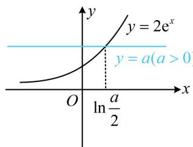

> [!faq]- 《第3节 分析带参函数的单调区间、极值、最值》例题解析
>
> > [!success]- **【答案】** 详见解析
>
> > [!note]- **【分析】**
> > 本题未单列分析。
>
> > [!note]- **【解析】**
> > 解：由题意， $f'(x)=2\mathrm{e}^{2x}-(a-2)\mathrm{e}^{x}-a=(2\mathrm{e}^{x}-a)(\mathrm{e}^{x}+1)$ ，（此处 $f'(x)$ 虽比例1复杂，但其符号与 $2\mathrm{e}^{x}-a$ 这部分的符号相同， $2\mathrm{e}^{x}-a=0\Leftrightarrow2\mathrm{e}^{x}=a$ ，如图，该因式是否有零点由a的正负决定，故据此讨论）
> > - **①**：当 $a \leq 0$ 时， $2\mathrm{e}^{x} - a > 0$ ， $\mathrm{e}^{x} + 1 > 0$
> >
> > 所以 $f^{\prime}(x) > 0$ ，故 $f(x)$ 在 $\mathbf{R}$ 上单调递增；
> > - **②**：当 a > 0 时， $e^{x} + 1 > 0$ ，
> >
> > 所以 $f^{\prime}(x) > 0 \Leftrightarrow 2\mathrm{e}^{x} - a > 0 \Leftrightarrow x > \ln \frac{a}{2}$ ,
> >
> > 
> >
> > $$
> > f ^ {\prime} (x) <   0 \Leftrightarrow 2 \mathrm{e} ^ {x} - a <   0 \Leftrightarrow x <   \ln \frac {a}{2},
> > $$
> >
> > 
> >
> > 故 $f(x)$ 在 $\left(-\infty, \ln \frac{a}{2}\right)$ 上单调递减，在 $\left(\ln \frac{a}{2}, +\infty\right)$ 上单调递增.
